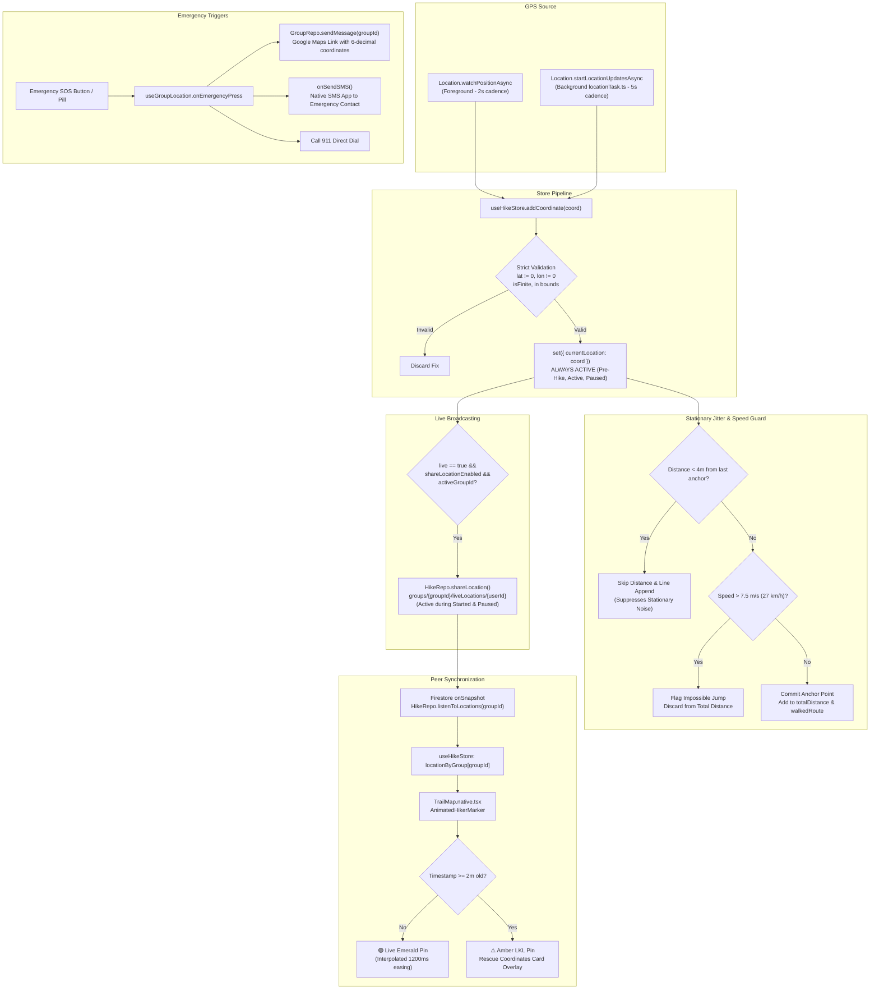

# Thrail Live Location & Emergency System: Comprehensive Audit & Remediation Plan

**Document:** `plans/LIVE_LOCATION_EMERGENCY_AUDIT_REPORT.md`  
**Status:** 🟡 **Audit Complete — Pending User Approval to Implement**  
**Scope:** Group Live Location Broadcasting, Emergency SOS, Last Known Location (LKL) Pin State, Pre-Hike GPS Availability, Stationary Jitter Filtering, Background Tracking, and Firestore Schema Isolation.  
**Reviewed Components:**
- [`CreateHikeFlow.ts`](file:///d:/thrail_app/src/core/flows/CreateHikeFlow.ts)
- [`hikeStoreCreator.ts`](file:///d:/thrail_app/src/core/models/Hike/stores/hikeStoreCreator.ts)
- [`HikeRepository.ts`](file:///d:/thrail_app/src/core/models/Hike/repositories/HikeRepository.ts)
- [`LocationFactory.ts`](file:///d:/thrail_app/src/core/models/Location/utils/LocationFactory.ts)
- [`useGroupLocation.ts`](file:///d:/thrail_app/src/core/models/Group/hooks/useGroupLocation.ts)
- [`locationTask.ts`](file:///d:/thrail_app/src/core/utility/locationTask.ts)
- [`TrailMap.native.tsx`](file:///d:/thrail_app/src/features/Map/TrailMap.native.tsx)
- [`hike/view.tsx`](file:///d:/thrail_app/src/app/(app)/(main)/hike/view.tsx)

---

## 1. Executive Summary & Firestore Isolation Verification

### 1.1 Did the Recent Route Storage Changes Break Live Location?
**No. Live location was NOT broken by the recent route persistence changes.**

The two systems use completely independent Firestore collections, converters, and lifecycles:

| Dimension | Historical Hike Route (Refactored in Items 12 & 13) | Emergency Live Location (Real-Time Safety System) |
| :--- | :--- | :--- |
| **Firestore Path** | `users/{userId}/hikes/{hikeId}/route/session` | `groups/{groupId}/liveLocations/{userId}` |
| **Lifecycle** | Written **once** upon hike completion (`onCompleteHike`) | Updated continuously on every GPS tick (foreground & background) |
| **Data Structure** | Multi-segment breadcrumb array: `segments: [number, number][][]`, `coordinates: [number, number][]` | GeoPoint document with converter: `point: GeoPoint(lat, lon)`, `altitude`, `timestamp`, `hikerName`, `status` |
| **Target Audience** | The individual hiker reviewing past hike statistics | All group members, guides, and mountain search-and-rescue teams |
| **Repository Methods** | `writeRoute()`, `fetchRoute()` | `shareLocation()`, `deleteLocation()`, `listenToLocations()` |

The recent changes to `HikeRepository.writeRoute` and `fetchRoute` touched only the consolidated hike route document and had zero side effects on `shareLocation` or `listenToLocations`.

---

## 2. End-to-End Live Location & Emergency Architecture



---

## 3. Deep Audit Findings: 6 Critical Latent Issues

While the route storage refactoring is safe, a thorough line-by-line inspection of the live location codebase revealed **six latent issues** that impact emergency reliability, automatic group broadcasting, and stationary GPS noise.

---

### Finding 1: `onStartSharingLocation` is Commented Out on Hike Start
- **Location:** [`src/core/flows/CreateHikeFlow.ts:L120-125`](file:///d:/thrail_app/src/core/flows/CreateHikeFlow.ts#L120-L125)
- **Current Code:**
  ```typescript
  await startHike(currentHike, { id: profile.id, firstname: profile.firstname, lastname: profile.lastname });
  if (groupId) {
      updateHikeStore({
          activeGroupId: groupId,
      });
      // await onStartSharingLocation();  // ❌ COMMENTED OUT!
  }
  startBackgroundTracking();
  ```
- **Technical Problem:**
  1. When a hiker taps "Start Hike", [`startShareLocation`](file:///d:/thrail_app/src/core/models/Hike/stores/hikeStoreCreator.ts#L229) is never invoked.
  2. Because `startShareLocation` is not called:
     - `useHikeStore.live` remains `false`.
     - `HikeRepo.listenToLocations(groupId)` is never mounted.
     - `locationByGroup[groupId]` stays empty (`[]`), meaning **no group peers ever appear on the map**.
     - In [`addCoordinate`](file:///d:/thrail_app/src/core/models/Hike/stores/hikeStoreCreator.ts#L212), `if (get().live && get().shareLocationEnabled && activeGroupId)` evaluates to `false`, so **the user's own live coordinates are never published to Firestore**.
  3. Currently, live sharing only turns on if the user opens the "Map Options" modal and manually toggles "Share My Location" OFF and then ON.
- **Root Cause:** Commented out on initial flow creation (August 31, 2026) to prevent startup crashes when coordinates were not yet populated.

---

### Finding 2: Risk of Writing Null Island `(0, 0)` Coordinates on Immediate Share
- **Location:** [`src/core/models/Hike/stores/hikeStoreCreator.ts:L239-247`](file:///d:/thrail_app/src/core/models/Hike/stores/hikeStoreCreator.ts#L239-L247)
- **Current Code:**
  ```typescript
  if (get().shareLocationEnabled) {
      const name = profile ? `${profile.firstname} ${profile.lastname || ''}`.trim() : 'Anonymous Hiker';
      const lastCoordinate = get().getLastKnownCoordinate() || newLocation(); // ❌ Defaults to (0, 0)!
      const coordinateWithHikerName = newLocation({
          ...lastCoordinate,
          hikerName: name
      });
      await HikeRepo.shareLocation(profile.id, groupId, coordinateWithHikerName);
  }
  ```
- **Technical Problem:**
  1. When starting a hike, `getLastKnownCoordinate()` is `null` because the telemetry queue was just reset to `[]`.
  2. `newLocation()` produces `{ latitude: 0, longitude: 0 }`.
  3. Writing `{ latitude: 0, longitude: 0 }` to Firestore places a phantom pin off the coast of Africa (Null Island).
  4. Any active peer listener immediately receives `(0, 0)` before real GPS arrives.
- **Solution:** Guard `startShareLocation` to only execute `HikeRepo.shareLocation` if `lastCoordinate` has valid non-zero numbers. Otherwise, attach the listener immediately and let the first incoming GPS fix in `addCoordinate` publish the initial position.

---

### Finding 3: Premature `CreateHikeFlow` Instantiation Before Group Resolution
- **Location:** [`src/app/(app)/(main)/hike/view.tsx:L55-61`](file:///d:/thrail_app/src/app/(app)/(main)/hike/view.tsx#L55-L61)
- **Current Code:**
  ```typescript
  // Line 55: CreateHikeFlow receives groupId directly from URL search params
  const { ... } = CreateHikeFlow({ hikeId, trailId, bookingId, groupId });

  // Lines 57-61: resolvedGroupId is computed AFTER CreateHikeFlow has already initialized
  const resolvedBookingId = bookingId || (currentHike?.mode === 'booked' ? currentHike.bookingId : undefined);
  const resolvedGroupId = groupId || (resolvedBookingId && groups?.find(g =>
      g.members?.some((m: { id?: string; bookingId?: string }) => m.id === profile?.id && m.bookingId === resolvedBookingId)
  )?.id) || undefined;
  ```
- **Technical Problem:**
  1. When a user navigates to a hike via a booking card where only `bookingId` is passed (e.g. without explicit `groupId` in query params), `CreateHikeFlow` receives `params.groupId = undefined`.
  2. `resolvedGroupId` correctly identifies the group from the user's booking, but `CreateHikeFlow` never receives it.
  3. As a result, `CreateHikeFlow` cannot bind to the group, cannot enable location sharing, and group cleanup fails.
- **Solution:** Compute `resolvedGroupId` *before* invoking `CreateHikeFlow`, passing `groupId: resolvedGroupId || groupId`.

---

### Finding 4: Total Live Location Blackout During Hike Pause
- **Location:** [`src/core/models/Hike/stores/hikeStoreCreator.ts:L160-163`](file:///d:/thrail_app/src/core/models/Hike/stores/hikeStoreCreator.ts#L160-L163)
- **Current Code:**
  ```typescript
  // Line 161: Exits immediately if hike is paused
  if (!active || !currentHike || currentHike.status !== 'started') {
      return;
  }
  // ...
  // Line 212: Live SAR group pin sharing is located AFTER the early return!
  if (get().live && get().shareLocationEnabled && activeGroupId) {
      await HikeRepo.shareLocation(profile.id, activeGroupId, coordinateWithHikerName);
  }
  ```
- **Technical Problem:**
  1. When a hike is paused (`currentHike.status === 'paused'`), `addCoordinate` exits immediately at line 161.
  2. This correctly halts `walkedRoute` trace line drawing and `totalDistance` accumulation (as desired for Item 13).
  3. However, it **also completely halts live location broadcasting to Firestore**.
  4. If an injured or exhausted hiker pauses their hike to rest, wait for help, or move slowly off-trail:
     - Their live coordinates stop transmitting to group members.
     - Within 2 minutes, peer devices mark them as "Signal Lost" (LKL).
     - Search and rescue / guides cannot see where the paused hiker is moving or resting in real time.
- **Solution:** Decouple session route recording from live emergency broadcasting:
  - Route line and distance calculation run strictly when `currentHike.status === 'started'`.
  - Live SAR group pin sharing runs whenever `currentHike.status === 'started' || currentHike.status === 'paused'`.

---

### Finding 5: Pre-Hike GPS Detection Blackout (Emergency SOS Disabled Before Hike Start)
- **Location:** [`src/core/flows/TrackHikerGPSFlow.ts:L160-170`](file:///d:/thrail_app/src/core/flows/TrackHikerGPSFlow.ts#L160-L170) & [`src/core/models/Group/hooks/useGroupLocation.ts:L99-102`](file:///d:/thrail_app/src/core/models/Group/hooks/useGroupLocation.ts#L99-L102)
- **Current Code in `TrackHikerGPSFlow.ts`:**
  ```typescript
  // Global Store Integration: only record breadcrumbs when hike is actively started
  const { active, currentHike } = useHikeStore.getState();
  if (active && currentHike?.status === 'started') {
      addCoordinate(newLocation({ ... }));
  }
  ```
- **Current Code in `useGroupLocation.ts`:**
  ```typescript
  const currentLocation = useHikeStore(s => s.currentLocation);
  // ...
  if (!currentLocation) {
      setLocalError("No location data available to send emergency alert");
      return;
  }
  ```
- **Technical Problem:**
  1. To fix Item 11 (preventing premature trace line drawing before tapping Start), `addCoordinate` was placed entirely behind `if (active && currentHike?.status === 'started')`.
  2. However, `useHikeStore.currentLocation` is *only* updated inside `addCoordinate`!
  3. As a result, **before tapping "Start Hike", `useHikeStore.currentLocation` is `null`**.
  4. If an emergency occurs before starting the hike (e.g. hiker injured at jump-off point, lightning strike, medical episode, or lost prior to pressing Start):
     - The hiker presses the red **Emergency SOS** button.
     - `onEmergencyPress` detects `currentLocation === null` and **fails immediately with `"No location data available to send emergency alert"`**.
     - `onSendSMS` sends `[undefined, undefined]` to the emergency contact number!
- **Solution:** 
  - `watchPositionAsync` in `TrackHikerGPSFlow` must ALWAYS feed valid GPS coordinates to `useHikeStore.setCurrentLocation(coord)`.
  - `currentLocation` remains continuously live and fresh 24/7 for emergency dispatch.
  - Trace line recording (`walkedRoute`) and distance accumulators remain strictly guarded by `status === 'started'`.

---

### Finding 6: GPS Jitter Accumulation While Stationary & Impossible Jump Glitches
- **Location:** [`src/core/models/Hike/stores/hikeStoreCreator.ts:L190-207`](file:///d:/thrail_app/src/core/models/Hike/stores/hikeStoreCreator.ts#L190-L207)
- **Current Code:**
  ```typescript
  const distMeters = calculateDistance(lastCoord.latitude, lastCoord.longitude, coordinate.latitude, coordinate.longitude);

  // Ignore sub-meter jitter (< 1m) and impossible GPS jumps (> 250m per tick)
  if (distMeters > 1 && distMeters < 250) {
      state.totalDistance += distMeters;
  }

  // Appends every coordinate to trace line without ANY distance deadband!
  state.coordinates.push(coordinate);
  currentSegment.push([coordinate.longitude, coordinate.latitude]);
  ```
- **Technical Problem:**
  1. **Stationary "Ghost Distance" Creep:**
     - Smartphone GPS has a standard accuracy drift of 2 to 6 meters when standing still (due to multipath interference and canopy foliage).
     - The existing threshold is `distMeters > 1` (1 meter).
     - Because stationary jitter bounces between 1.5m and 5m every 2 seconds, the store treats this as active walking!
     - **Mathematical Reality:** Resting at a scenic viewpoint or lunch stop for 20 minutes adds **~1.2 to 1.8 km of fake distance** and inflates elevation gain.
  2. **Spiderweb Trace Scribble:**
     - `currentSegment.push([lon, lat])` appends every 2-second fix unconditionally.
     - Standing in one place for 15 minutes plots ~450 tightly overlapping points, creating an ugly tangled scribble on the map.
  3. **Excessive "Impossible Jump" Upper Bound:**
     - The current upper bound is `distMeters < 250` (250 meters in 2 seconds = **450 km/h**!).
     - A pedestrian jump of 80 meters in 2 seconds is physically impossible on a trail, yet the app currently counts it as valid walking distance.

---

## 4. Remediation Plan (Architecture Specification — No Code Applied)

### Step 1: Fix Group Resolution in [`src/app/(app)/(main)/hike/view.tsx`](file:///d:/thrail_app/src/app/(app)/(main)/hike/view.tsx)
Reorder the resolution so `resolvedGroupId` is passed into `CreateHikeFlow`:
```typescript
// 1. Resolve booking and group first
const resolvedBookingId = bookingId || (storedHike?.mode === 'booked' ? storedHike.bookingId : undefined);
const resolvedGroupId = groupId || (resolvedBookingId && groups?.find(g =>
    g.members?.some((m) => m.id === profile?.id && m.bookingId === resolvedBookingId)
)?.id) || undefined;

// 2. Initialize CreateHikeFlow with the resolved group ID
const { ... } = CreateHikeFlow({ 
    hikeId, 
    trailId, 
    bookingId: resolvedBookingId || bookingId, 
    groupId: resolvedGroupId || groupId 
});
```

---

### Step 2: Automatically Activate Sharing in [`src/core/flows/CreateHikeFlow.ts`](file:///d:/thrail_app/src/core/flows/CreateHikeFlow.ts)
In `onStartHike`, safely activate location sharing when `groupId` exists:
```typescript
await startHike(currentHike, {
    id: profile.id,
    firstname: profile.firstname,
    lastname: profile.lastname
});

if (groupId) {
    updateHikeStore({ activeGroupId: groupId });
    try {
        await onStartSharingLocation();
    } catch (shareErr) {
        console.warn("[onStartHike] Background location share initialization warning:", shareErr);
    }
}

startBackgroundTracking();
```

---

### Step 3: Eliminate Null Island `(0, 0)` in [`src/core/models/Hike/stores/hikeStoreCreator.ts`](file:///d:/thrail_app/src/core/models/Hike/stores/hikeStoreCreator.ts)
In `startShareLocation`, only publish initial coordinates if valid non-zero coordinates exist:
```typescript
if (get().shareLocationEnabled) {
    const lastCoordinate = get().getLastKnownCoordinate();
    // Only publish immediately if a legitimate, non-zero coordinate already exists in store
    if (
        lastCoordinate &&
        typeof lastCoordinate.latitude === 'number' &&
        typeof lastCoordinate.longitude === 'number' &&
        (lastCoordinate.latitude !== 0 || lastCoordinate.longitude !== 0) &&
        !isNaN(lastCoordinate.latitude) && !isNaN(lastCoordinate.longitude)
    ) {
        const name = profile ? `${profile.firstname} ${profile.lastname || ''}`.trim() : 'Anonymous Hiker';
        const coordinateWithHikerName = newLocation({ ...lastCoordinate, hikerName: name });
        await HikeRepo.shareLocation(profile.id, groupId, coordinateWithHikerName);
    }
}

// Always attach the listener and set live: true
const unsubscribe = HikeRepo.listenToLocations(groupId, (locations) => set((state) => ({
    locationByGroup: { ...state.locationByGroup, [groupId]: locations }
})));

set((state) => ({
    activeGroupId: groupId,
    live: true,
    activeListeners: { ...state.activeListeners, [groupId]: unsubscribe }
}));
```

---

### Step 4: Keep Live Pin Broadcasting Active During Pause in [`hikeStoreCreator.ts`](file:///d:/thrail_app/src/core/models/Hike/stores/hikeStoreCreator.ts)
Decouple emergency live broadcasting from active distance recording:
- Route drawing and distance calculate strictly when `currentHike.status === 'started'`.
- Emergency live location broadcasts when `currentHike.status === 'started' || currentHike.status === 'paused'`.

```typescript
// 1. Session route drawing & distance (STRICTLY started hikes only)
if (active && currentHike && currentHike.status === 'started') {
    // Distance, elevation gain, and walkedRoute segment appending
    // ...
}

// 2. Emergency live location pin sharing (BOTH started and paused hikes)
if (active && currentHike && (currentHike.status === 'started' || currentHike.status === 'paused')) {
    if (get().live && get().shareLocationEnabled && activeGroupId && profile) {
        try {
            const name = `${profile.firstname} ${profile.lastname || ''}`.trim() || 'Anonymous Hiker';
            const coordinateWithHikerName = newLocation({
                ...coordinate,
                hikerName: name
            });
            await HikeRepo.shareLocation(profile.id, activeGroupId, coordinateWithHikerName);
        } catch (shareError) {
            console.error('[addCoordinate] Live location share failed:', shareError);
        }
    }
}
```

---

### Step 5: Continuous Pre-Hike GPS Availability for Emergency Readiness
In [`TrackHikerGPSFlow.ts`](file:///d:/thrail_app/src/core/flows/TrackHikerGPSFlow.ts):
- Always update `useHikeStore.getState().setCurrentLocation(coord)` on every valid GPS fix, regardless of hike status.
- Add `setCurrentLocation: (coord: Location) => void` in `hikeStoreCreator.ts`.
- This guarantees `currentLocation` is available immediately for Emergency SOS, even before tapping "Start Hike".

```typescript
// TrackHikerGPSFlow.ts watchPositionAsync callback:
setUserLocation([lon, lat]);

// Always feed the store's emergency currentLocation (works pre-hike, started, paused)
useHikeStore.getState().setCurrentLocation(newLocation({
    latitude: lat,
    longitude: lon,
    altitude: alt,
    timestamp: new Date(timestamp),
    status: 'ACTIVE',
}));

// Route breadcrumbs are still strictly guarded
const { active, currentHike } = useHikeStore.getState();
if (active && currentHike?.status === 'started') {
    addCoordinate(...);
}
```

---

### Step 6: Multi-Tiered Stationary Deadband & Speed Plausibility Guard
In [`hikeStoreCreator.ts`](file:///d:/thrail_app/src/core/models/Hike/stores/hikeStoreCreator.ts) inside `addCoordinate`:
Implement a 3-tier filtering algorithm:

#### Mathematical Guard Specification:
1. **Tier 1 — Stationary Deadband Filter ($< 3.5\text{ meters}$):**
   - If distance from last committed coordinate is $< 3.5\text{m}$, treat as GPS stationary drift.
   - Do NOT add to `totalDistance`.
   - Do NOT append a new point to `walkedRoute` (prevents spiderweb scribbles while resting).
2. **Tier 2 — Maximum Plausible Speed Filter ($> 7.5\text{ m/s}$ / $27\text{ km/h}$):**
   - Maximum sustainable sprint on rough mountain terrain is $\sim 5.5\text{ m/s}$.
   - For a 2-second interval, calculate velocity: $v = \frac{\Delta d}{\Delta t}$.
   - If $v > 7.5\text{ m/s}$ (or $\Delta d > 15\text{m}$ in a 2s tick):
     - Flag as `IMPOSSIBLE_GPS_JUMP`.
     - Reject from `totalDistance` and `totalElevationGain`.
     - Do not draw vector to this aberrant coordinate.
3. **Tier 3 — Elevation Gain Filter:**
   - Ignore vertical jitter: $|\Delta\text{alt}| < 2.5\text{m}$.
   - Discard vertical cliff glitches: $|\Delta\text{alt}| > 35\text{m}$ per tick.

#### Proposed Logic in `hikeStoreCreator.ts`:
```typescript
const lastCoord = state.coordinates[state.coordinates.length - 1];

if (lastCoord && typeof lastCoord.latitude === 'number' && typeof lastCoord.longitude === 'number') {
    const distMeters = calculateDistance(lastCoord.latitude, lastCoord.longitude, coordinate.latitude, coordinate.longitude);
    const timeDeltaSeconds = Math.max(1, (new Date(coordinate.timestamp).getTime() - new Date(lastCoord.timestamp).getTime()) / 1000);
    const speedMps = distMeters / timeDeltaSeconds;

    // 1. Stationary deadband filter (suppresses resting jitter)
    if (distMeters < 3.5) {
        return; // Hiker is stationary; ignore noise
    }

    // 2. Plausibility speed filter (suppresses impossible jumps/teleports)
    const MAX_HIKE_SPEED_MPS = 7.5; // ~27 km/h (beyond Olympic mountain sprint)
    if (speedMps > MAX_HIKE_SPEED_MPS) {
        console.warn(`[addCoordinate] Discarded impossible GPS jump: ${distMeters.toFixed(1)}m in ${timeDeltaSeconds.toFixed(1)}s (${(speedMps * 3.6).toFixed(1)} km/h)`);
        return;
    }

    // 3. Valid displacement committed
    state.totalDistance += distMeters;

    // 4. Elevation gain filter
    const altDiff = (coordinate.altitude || 0) - (lastCoord.altitude || 0);
    if (altDiff > 2.5 && altDiff < 35) {
        state.totalElevationGain += altDiff;
    }

    // 5. Append to session telemetry & active segment
    state.coordinates.push(coordinate);
    currentSegment.push([coordinate.longitude, coordinate.latitude]);
}
```

---

## 5. Verification & Testing Matrix

| Test Case | Scenario | Expected Behavior | Failure Signal |
| :--- | :--- | :--- | :--- |
| **T-1: Automatic Group Connect** | Start a booked hike with an active group. | (1) `live` flag sets to `true`.<br>(2) Peer pins appear on the map without manual menu toggles.<br>(3) User's document appears in `groups/{groupId}/liveLocations`. | Map shows no other hikers; user must toggle "Share My Location" in options. |
| **T-2: Zero (0, 0) Guard** | Tap "Start Hike" before GPS lock stabilizes. | No `(0, 0)` document written to Firestore. Real location publishes on first valid GPS tick. | Peer map briefly displays a marker at Null Island (off African coast). |
| **T-3: Paused Hiker Safety** | Hiker pauses hike for 10 minutes and walks 100 meters. | (1) Route line and distance stats remain cleanly stopped.<br>(2) Live pin in Firestore continues updating current position.<br>(3) Guide sees hiker moving live, without false "Signal Lost" alerts. | Live location freezes at pause point; peer screen shows amber "Signal Lost" alert despite active phone battery. |
| **T-4: Emergency SOS Dispatch** | Press red SOS button while paused. | (1) Group chat receives urgent distress message with accurate Google Maps URL.<br>(2) SMS prompt opens with pre-filled 6-decimal coordinates to emergency contact. | SMS shows empty coordinates `[undefined, undefined]` or fails to send. |
| **T-5: Pre-Hike Emergency SOS** | Open map screen, do NOT tap "Start Hike", press SOS button. | (1) GPS lock immediately resolves coordinates into `currentLocation`.<br>(2) SOS sends working Google Maps link with exact coordinates.<br>(3) Trace line remains empty (zero breadcrumbs). | Screen shows error *"No location data available to send emergency alert"* or sends undefined coordinates. |
| **T-6: Stationary Jitter Suppression** | Leave phone on a table for 15 minutes with hike active. | (1) `totalDistance` increases by **0 meters**.<br>(2) Map trace remains a single clean dot without spiderweb scribble.<br>(3) Live location pin stays steady. | Distance increases by 300–800m while sitting still; map shows messy cluster of zig-zags. |
| **T-7: Impossible Jump Rejection** | Simulate 100m GPS glitch in 2 seconds. | Jump is rejected from distance and route line. System logs impossible jump warning. | Distance jumps by 100m; straight line shoots across screen. |
| **T-8: Session Cleanup** | Guide taps "Complete Hike". | (1) Live location document deleted from Firestore.<br>(2) Completed route saved in `users/{userId}/hikes/{hikeId}/route/session`.<br>(3) Map listeners unmount cleanly. | Old live pin remains stuck in group chat indefinitely after hike ends. |

---

## 6. Current Implementation Status

- [x] Full Codebase Audit Completed
- [x] Firestore Schema Isolation Confirmed
- [x] Technical Root Cause Identified for all 6 Issues
- [x] Pre-Hike Emergency GPS Availability Analyzed
- [x] Stationary Jitter & Speed Filtering Algorithm Formulated
- [x] Architectural Remediation Plan Formulated
- [x] **Finding 5 Implemented:** Pre-Hike Continuous GPS Detection for Emergency Readiness (`TrackHikerGPSFlow.ts` + `hikeStoreCreator.ts`)
- [x] **Finding 6 Implemented:** Multi-Tier Stationary Deadband (< 3.5m) and Speed Plausibility Guard (<= 7.5 m/s) (`hikeStoreCreator.ts`)
- [ ] Findings 1 to 4 Code Implementation *(Awaiting User Instruction)*
