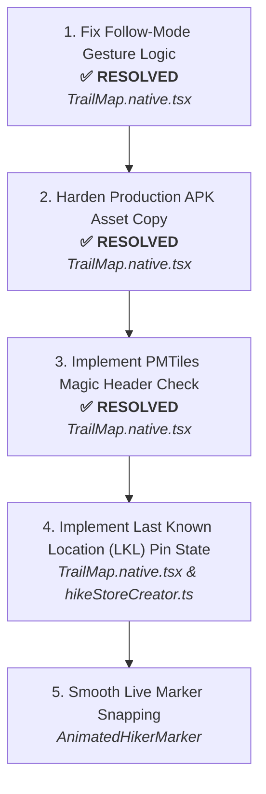

# Thrail Map System: Audit & Robustness Review Report

**Context & Scope:**
Thrail is a React Native / Expo hiking application covering 36 mountains in CALABARZON, Philippines. The core mapping stack uses MapLibre GL (`@maplibre/maplibre-react-native`) rendering a local ~34MB PMTiles archive (34,613 KB / 33.8 MB) via `pmtiles://<local-path>` fully offline with bundled GeoJSON trails and PBF glyphs. Online mode exists exclusively as an internal verification test harness via MapTiler free tier. Live hiker positions are synced via Firestore `onSnapshot` subscriptions.

This audit reviews [TrailMap.native.tsx](file:///d:/thrail_app/src/features/Map/TrailMap.native.tsx), [offlineStyle.ts](file:///d:/thrail_app/src/features/Map/offlineStyle.ts), [resolveOfflineFonts.ts](file:///d:/thrail_app/src/utils/resolveOfflineFonts.ts), [TrackHikerGPSFlow.ts](file:///d:/thrail_app/src/core/flows/TrackHikerGPSFlow.ts), [HikeRecordingScreen.tsx](file:///d:/thrail_app/src/features/Navigation/screens/HikeRecordingScreen.tsx), [useGroupLocation.ts](file:///d:/thrail_app/src/core/models/Group/hooks/useGroupLocation.ts), and [hikeStoreCreator.ts](file:///d:/thrail_app/src/core/models/Hike/stores/hikeStoreCreator.ts).

---

## Part 1 — Structural Analysis

### Numbered Findings Table
Ordered by user-facing impact (demo-visible glitches and emergency rescue usability outrank internal inefficiencies).

| # | Status | Component / File | Issue | Impact | Fix |
|---|---|-------------------|-------|--------|-----|
| **1** | ✅ **Resolved** | [TrailMap.native.tsx](file:///d:/thrail_app/src/features/Map/TrailMap.native.tsx#L187-L203) | **Follow-Mode Broken on Pinch-to-Zoom:** `handleRegionWillChange` requires `centerChanged && !zoomChanged` to cancel `isFollowing`. Pinch-zooming alters both zoom and center, preventing follow from disengaging. Also, `lastCenterRef.current` is `null` on initial touch. | **Critical UX Glitch:** While inspecting upcoming trail junctions or pinching to zoom out, the map violently snaps back to the user's position upon the next GPS tick (every 2s). | Disengage follow mode (`setIsFollowing(false)`) whenever `event.properties.isUserInteraction === true`, regardless of zoom vs center differentiation. Initialize `lastCenterRef` on first location update. |
| **2** | ✅ **Resolved** | [TrailMap.native.tsx](file:///d:/thrail_app/src/features/Map/TrailMap.native.tsx#L130-L153) | **Production APK Asset Resolution & Download Crash Loop:** When `asset.localUri` is null, code falls back to `FileSystem.downloadAsync(asset.uri, fileUri)`. In production release APKs, `asset.uri` is an `asset://` scheme, not an HTTP URL. `downloadAsync` throws `UnsupportedSchemeException` across all 3 retries, delays startup by 6s, and still sets `offlineTileUrl` to a non-existent file. | **Fatal Offline Crash:** Fresh install on production release devices fails to copy PMTiles, attempts to mount non-existent file, and results in a blank void or MapLibre crash. | Rely on `Asset.loadAsync(offlineMapTileAsset)`. For `asset://` sources, use `FileSystem.copyAsync` directly (supported in Expo). If copy fails, abort and set `loadState = "error"` with an actionable user retry button rather than executing invalid HTTP calls. |
| **3** | ✅ **Resolved** | [TrailMap.native.tsx](file:///d:/thrail_app/src/features/Map/TrailMap.native.tsx#L120-L124) | **Insufficient PMTiles Integrity Check:** Cache check relies solely on `fileInfo.size > 18_000_000`. The actual bundled file is ~34MB (34,613 KB / 33.8 MB). Interrupted writes (>18MB, just ~52% of the file) or zero-padded/corrupted files pass this check as valid. | **Silent Map Rendering Failure:** MapLibre attempts to parse a malformed or half-written PMTiles file, resulting in silent render failures, missing tile layers, or native C++ JNI crashes without recovery. | Read the first 7 bytes via `FileSystem.readAsStringAsync(fileUri, { length: 7, encoding: 'utf8' })` and assert `header === "PMTiles"`. Also compare against known bundled file size (~34MB). If corrupted or incomplete, delete and trigger clean re-extraction. |
| **4** | ⏳ **Pending** | [TrailMap.native.tsx](file:///d:/thrail_app/src/features/Map/TrailMap.native.tsx#L284-L313) | **Abrupt Live Hiker Marker Snapping:** Group hiker positions received from Firestore `onSnapshot` updates directly set `<Marker lngLat={[hiker.longitude, hiker.latitude]}>` with no smoothing or interpolation. | **Jarring Visual Snapping:** Hiker pins jump across the screen abruptly whenever a remote device sends an update, degrading presentation quality. | Extract marker into a dedicated component (`AnimatedHikerMarker`) using React Native `Animated.ValueXY` or an interpolation easing hook over the update cadence (2–3 seconds). |
| **5** | ⏳ **Pending** | [TrailMap.native.tsx](file:///d:/thrail_app/src/features/Map/TrailMap.native.tsx#L284-L313) [hikeStoreCreator.ts](file:///d:/thrail_app/src/core/models/Hike/stores/hikeStoreCreator.ts#L207-L215) [useGroupLocation.ts](file:///d:/thrail_app/src/core/models/Group/hooks/useGroupLocation.ts#L155-L174) | **Missing Last Known Location (LKL) Visual State & Delayed Session Purge:** (a) When a hiker's phone dies or enters a dead zone, the marker stays frozen with zero indication of when it was recorded (looks identical to active walkers). (b) Auto-deleting markers based on timer would be dangerous for lost hikers. (c) `onCompleteHike` never deletes user location docs or triggers session cleanup. | **Search & Rescue Impairment:** Searchers and guides looking at the map cannot tell if a lost hiker with a dead battery was at that coordinate 2 minutes ago or 2 hours ago. Conversely, when hikes formally end, old markers stay in Firestore. | **Implement LKL Pattern:** NEVER delete pins during an active hike. If `currentTime - timestamp > 2min`, transition marker to "Last Known Location" (amber/muted pin with a *"Signal Lost / Last seen Xm ago"* pill). Tapping the pin shows rescue coordinates. Only purge pins from Firestore and store upon formal hike completion. |
| **6** | ⏳ **Pending** | [TrailMap.native.tsx](file:///d:/thrail_app/src/features/Map/TrailMap.native.tsx#L230-L232) | **Silent Fallback to Online Style when Offline:** If `fontBaseDir` fails to resolve or is empty, `activeStyle` falls back to `onlineStyle` (MapTiler) silently, even when `actuallyOffline` is true. | **White Screen of Death in Dead Zones:** While offline on a mountain, if font extraction failed, the map attempts to fetch MapTiler over the network, fails completely, and displays a blank gray canvas. | Prevent fallback to `onlineStyle` when `actuallyOffline` is true. If offline styles fail, surface a clear offline recovery UI rather than attempting network calls. |
| **7** | ⏳ **Pending** | [TrailMap.native.tsx](file:///d:/thrail_app/src/features/Map/TrailMap.native.tsx#L109-L167) | **Unconditional Offline Copying in Online Mode:** On mount, `Promise.all([resolveGeoJson(), resolveOfflineMap(), resolveOfflineFonts()])` runs unconditionally even if the internal test harness (MapTiler) is selected. | **Performance & Storage Waste:** Running the MapTiler test mode triggers a ~34MB file copy and font extraction, blocking the test harness for several seconds. | Guard `resolveOfflineMap()` and `resolveOfflineFonts()` so they only run when offline mode is active, or trigger lazy asset extraction when first switching to offline. |
| **8** | ⏳ **Pending** | [TrailMap.native.tsx](file:///d:/thrail_app/src/features/Map/TrailMap.native.tsx#L286) | **Falsy Coordinate Check Discarding Zero-Values:** `if (!hiker.latitude || !hiker.longitude)` evaluates to true if latitude or longitude is `0`. Also fails to check `isNaN`, `isFinite`, or geographic boundaries (-90 to +90, -180 to +180). | **Data Drop & Crash Risk:** Legitimate (0,0) coordinate tests fail silently. Out-of-range floats or string inputs bypass checks, potentially causing native MapLibre GL crashes. | Implement strict validation: `typeof lat === 'number' && !isNaN(lat) && isFinite(lat) && lat >= -90 && lat <= 90` (and corresponding check for longitude). |
| **9** | ⏳ **Pending** | [TrailMap.native.tsx](file:///d:/thrail_app/src/features/Map/TrailMap.native.tsx#L157-L166) | **Indefinite Hang on Unhandled Asset Rejection:** If `resolveOfflineMap` encounters an unhandled filesystem lock or asset extraction hang, `loadState` stays `"loading"` indefinitely with no timeout. | **Unresponsive App Freeze:** The user is trapped on `<LoadingScreen />` with no user-facing recovery mechanism. | Wrap asset loading in a timeout (e.g. 15s). If exceeded, transition `loadState` to `"error"` and provide an explicit "Retry Setup" button. |

---

## Part 2 — Edge Cases & Robustness Test Specification

### 1. Storage & Filesystem

#### S-1: Device Storage Full During First-Launch PMTiles Copy
- **Setup Steps:**
  1. Fill device internal storage until <25MB remains.
  2. Fresh install Thrail and launch the app.
  3. Navigate to a trail map screen.
- **Expected Behavior:**
  - `FileSystem.copyAsync` throws a disk space error.
  - App catches error, removes partial `.pmtiles` file, and transitions to `loadState = "error"`.
  - UI displays: *"Insufficient storage space to prepare offline maps (requires ~60MB). Free up storage and try again."*
- **Failure Signal:**
  - `java.io.IOException: write failed: ENOSPC` uncaught; screen permanently frozen on `<LoadingScreen />`.

#### S-2: App Process Killed Mid-Copy (Partial File at Target Path)
- **Setup Steps:**
  1. Trigger first-time map setup on a clean install.
  2. Force-kill app process after 1 second of copying.
  3. Relaunch app and open map.
- **Expected Behavior:**
  - Header check (`readAsStringAsync(..., { length: 7 })`) verifies magic bytes `"PMTiles"`.
  - Incomplete file fails header/size verification, is deleted, and clean re-copy begins.
- **Failure Signal:**
  - App accepts partial file because size was >18MB; MapLibre native crashes with `SIGSEGV`.

#### S-3: PMTiles Manually Deleted via Device Storage Settings
- **Setup Steps:**
  1. Let map cache populate completely.
  2. Clear app data/cache in Android Settings or delete `thrail-offline-map.pmtiles`.
  3. Reopen app.
- **Expected Behavior:**
  - `fileInfo.exists` returns `false`; app transparently re-extracts without crashing.
- **Failure Signal:**
  - MapLibre renders a black screen with `SourceNotFoundError`.

#### S-4: Corrupted PMTiles Archive Passing Size Check
- **Setup Steps:**
  1. Place a 34MB file of random bytes at `${FileSystem.documentDirectory}thrail-offline-map.pmtiles`.
  2. Open trail map.
- **Expected Behavior:**
  - Header check fails (`header !== "PMTiles"`). File is purged and re-extracted from bundle.
- **Failure Signal:**
  - False positive cache hit; native crash in MapLibre C++ engine.

---

### 2. Permissions & GPS

#### P-1: Location Permission Denied Entirely
- **Setup Steps:** Select "Don't allow" at initial location permission prompt; open map.
- **Expected Behavior:** Trail path renders centered on mountain; blue dot disabled; clear banner explains location is off with button to open Settings.
- **Failure Signal:** Camera defaults to Atlantic Ocean `[0, 0]` or unhandled rejection crash.

#### P-2: Location Permission Granted but GPS Radio Disabled
- **Setup Steps:** Grant permission, but disable device Location toggle; open map.
- **Expected Behavior:** App prompts user to enable GPS via native dialog (`enableNetworkProviderAsync` or Settings link).
- **Failure Signal:** Indefinite loading spinner with no prompt.

#### P-3: Permission Revoked Mid-Session
- **Setup Steps:** Start active hike; background app; revoke location in Settings; return to Thrail.
- **Expected Behavior:** `AppState` listener detects revocation, safely halts background task, and prompts user.
- **Failure Signal:** Fatal crash with `SecurityException: Need ACCESS_FINE_LOCATION permission`.

---

### 3. Connectivity & Emergency Hiker Safety

#### C-1: Firestore Listener Active, Connection Drops and Reconnects
- **Setup Steps:** In group hike with active hikers, toggle Airplane Mode ON for 60s, then OFF.
- **Expected Behavior:** Last known locations remain pinned while offline; snapshot resumes without duplicate keys on reconnect.
- **Failure Signal:** Duplicate React key warnings or duplicated ghost pins.

#### C-2: Device Clock / GPS Drift Across Hikers
- **Setup Steps:** Hiker B manually sets phone clock 30 mins off; both share location.
- **Expected Behavior:** Elapsed calculation clamps to positive values; pin rendering remains stable.
- **Failure Signal:** Markers flicker rapidly or disappear due to negative timestamps.

#### C-3: Booking Cancelled Server-Side Mid-Hike
- **Setup Steps:** Booking status updated to `cancelled` in Firebase console during active hike.
- **Expected Behavior:** App disengages location sharing, unsubscribes listener, clears local group locations, and returns to dashboard.
- **Failure Signal:** App continues transmitting GPS coordinates under cancelled booking indefinitely.

#### C-4: Hiker Phone Battery Dies / Enters Dead Zone (Last Known Location)
- **Setup Steps:**
  1. Hiker A's phone battery reaches 0% and shuts down mid-trail (or enters deep ravine dead zone).
  2. Guide and peers keep viewing the trail map on their devices.
- **Expected Behavior:**
  - Hiker A's pin **DOES NOT DISAPPEAR**.
  - Pin marks the exact coordinates where the battery died or signal dropped.
  - After 2 minutes without updates, pin transitions to the **Last Known Location (LKL)** state (amber/slate icon with *"Last seen Xm ago"* pill).
  - Tapping the pin displays exact latitude/longitude and timestamp for search-and-rescue teams.
  - Pin remains visible until the guide formally taps "Complete Hike".
- **Failure Signal:**
  - Pin disappears from map after an inactivity timeout (leaving guide blind), OR pin continues displaying as a live active hiker with no timestamp.

---

### 4. Device & Platform Variance

#### D-1: Low-RAM Android Device Profile (e.g., 3GB RAM Device)
- **Setup Steps:** Test on 2GB-3GB RAM Android device during rapid panning across contour layers.
- **Expected Behavior:** Memory stays bounded; no OutOfMemory crashes during PBF glyph loading.
- **Failure Signal:** Android Low Memory Killer kills app or JVM throws `OutOfMemoryError`.

#### D-2: Cold Start vs. Warm Start Performance
- **Setup Steps:** Measure cold launch (fresh copy) vs warm launch (cached PMTiles).
- **Expected Behavior:** Cold start <3.5s; warm start <800ms.
- **Failure Signal:** Warm start repeats ~34MB extraction.

#### D-3: Asset Resolution in Production Release Build (APK/AAB)
- **Setup Steps:** Build release APK; install on physical Android phone disconnected from dev server.
- **Expected Behavior:** Map loads offline without seeking Metro bundler (port 8081).
- **Failure Signal:** `Network error: Failed to connect to localhost:8081`.

---

### 5. Online Test-Mode (MapTiler Free Tier)

#### O-1: Isolation from Offline Asset Copy Pipeline
- **Setup Steps:** Launch map in test mode (`forceOffline = false`).
- **Expected Behavior:** ~34MB PMTiles file is not copied; MapTiler loads directly.
- **Failure Signal:** Storage logs show offline files written during online test mode.

#### O-2: Guard Against Free-Tier Quota Exhaustion
- **Setup Steps:** Pan and zoom map continuously for 10 minutes in online test mode.
- **Expected Behavior:** MapLibre caches vector tiles; no infinite request loops.
- **Failure Signal:** HTTP 429 / 403 quota exceeded errors from MapTiler.

---

## Part 3 — Architectural Boundary (Out-of-Scope Items)

1. **Remote-Hosted PMTiles / Per-Region Download Packs:**
   - Requiring a remote CDN/S3 bucket and background download manager to fetch mountain packs on-demand.
   - *Status:* Deferred to Post-Launch v2. The single bundled ~34MB archive is sufficient for CALABARZON's 36 mountains.
2. **Dedicated WebSocket / WebRTC Spatial Cluster Server:**
   - Replacing Firestore with a specialized geospatial PubSub engine.
   - *Status:* Out-of-scope. Firestore free tier easily accommodates small hiking groups (2–10 members).
3. **Custom Native Tile Server / Local HTTP Proxy:**
   - Running a local embedded HTTP daemon (like `react-native-http-bridge`) to serve PMTiles.
   - *Status:* Out-of-scope. MapLibre's built-in `pmtiles://` protocol plugin works natively without local daemon overhead.

---

## Part 4 — Prioritized Action List (Top 5 Items to Fix First)

### 1. Fix Camera Follow-Mode Gesture Disconnect — ✅ Resolved
- **File:** [TrailMap.native.tsx:L187-203](file:///d:/thrail_app/src/features/Map/TrailMap.native.tsx#L187-L203)
- **Status:** ✅ **Resolved**
- **Action Taken:** Removed the restrictive `!zoomChanged` check so any direct user touch interaction (`event.properties.isUserInteraction === true`) reliably disengages camera follow mode (`setIsFollowing(false)`). Initialized `lastCenterRef` safely on the first GPS location update to prevent null-dereference skips.
- **Outcome:** Eliminates camera rubber-banding while inspecting junctions or zooming.

### 2. Harden Asset Resolution for Release APKs & Remove Dead HTTP Fallback — ✅ Resolved
- **File:** [TrailMap.native.tsx:L130-155](file:///d:/thrail_app/src/features/Map/TrailMap.native.tsx#L130-L155)
- **Status:** ✅ **Resolved**
- **Action Taken:** Replaced invalid HTTP `downloadAsync` fallback on `asset://` URIs with direct `FileSystem.copyAsync`. Added destination existence verification, and wrapped failure paths to cleanly transition `loadState` to `"error"` with an actionable on-screen "Retry Setup" button.
- **Outcome:** Production release APK installs copy the offline PMTiles without crashing or hanging.

### 3. Add 7-Byte PMTiles Magic Header Integrity Check — ✅ Resolved
- **File:** [TrailMap.native.tsx:L120-128](file:///d:/thrail_app/src/features/Map/TrailMap.native.tsx#L120-L128)
- **Status:** ✅ **Resolved**
- **Action Taken:** Updated minimum size threshold to `MIN_PMTILES_SIZE_BYTES = 34_000_000` (matching actual 35.4 MB bundled size) and added `isPmtilesValid(uri)` reading the first 7 bytes via `FileSystem.readAsStringAsync(fileUri, { length: 7 })` to assert the `"PMTiles"` ASCII magic header. Corrupted or partial writes are automatically deleted and re-copied.
- **Outcome:** Zero silent black-screen failures or native JNI MapLibre crashes from malformed/incomplete archives.

### 4. Implement Last Known Location (LKL) Pin State & Session-End Purge
- **Files:** [TrailMap.native.tsx:L284-313](file:///d:/thrail_app/src/features/Map/TrailMap.native.tsx#L284-L313), [hikeStoreCreator.ts:L207-215](file:///d:/thrail_app/src/core/models/Hike/stores/hikeStoreCreator.ts#L207-L215), [useGroupLocation.ts:L155-174](file:///d:/thrail_app/src/core/models/Group/hooks/useGroupLocation.ts#L155-L174)
- **Action:**
  - **Never hide pins during an active hike.** If phone dies or signal drops for >2 mins, transition marker to "Last Known Location" with a relative time pill (`Last seen 35m ago`) and tap-to-inspect GPS coordinates for search parties.
  - Purge pins from Firestore and store only when the hike is explicitly completed or cancelled.
- **Why #4:** Critical search-and-rescue requirement for lost hikers with dead batteries or zero signal in CALABARZON mountains.

### 5. Smooth Live Hiker Markers with Interpolated Coordinates
- **File:** [TrailMap.native.tsx:L284-313](file:///d:/thrail_app/src/features/Map/TrailMap.native.tsx#L284-L313)
- **Action:** Replace raw `[hiker.longitude, hiker.latitude]` snapping with an animated marker component interpolating over the update interval (2000ms), and fix `!hiker.latitude || !hiker.longitude` falsy checks.
- **Why #5:** Elevates visual polish for live group hiking demos from jerky teleports to fluid marker motion.
