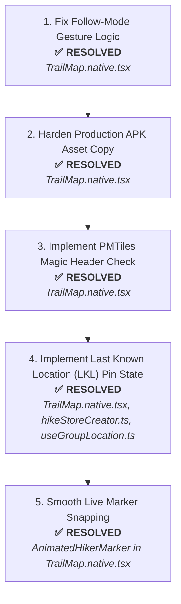

# Thrail Map System: Audit & Robustness Review Report

**Context & Scope:**
Thrail is a React Native / Expo hiking application covering 36 mountains in CALABARZON, Philippines. The core mapping stack uses MapLibre GL (`@maplibre/maplibre-react-native`) rendering a local ~34MB PMTiles archive (34,613 KB / 33.8 MB) via `pmtiles://<local-path>` fully offline with bundled GeoJSON trails and PBF glyphs. Online mode exists exclusively as an internal verification test harness via MapTiler free tier. Live hiker positions are synced via Firestore `onSnapshot` subscriptions.

This audit reviews [TrailMap.native.tsx](file:///d:/thrail_app/src/features/Map/TrailMap.native.tsx), [offlineStyle.ts](file:///d:/thrail_app/src/features/Map/offlineStyle.ts), [resolveOfflineFonts.ts](file:///d:/thrail_app/src/utils/resolveOfflineFonts.ts), [TrackHikerGPSFlow.ts](file:///d:/thrail_app/src/core/flows/TrackHikerGPSFlow.ts), [HikeRecordingScreen.tsx](file:///d:/thrail_app/src/features/Navigation/screens/HikeRecordingScreen.tsx), [useGroupLocation.ts](file:///d:/thrail_app/src/core/models/Group/hooks/useGroupLocation.ts), and [hikeStoreCreator.ts](file:///d:/thrail_app/src/core/models/Hike/stores/hikeStoreCreator.ts).

---

## Part 1 — Structural Analysis

### Numbered Findings Table
Ordered by user-facing impact (demo-visible glitches and emergency rescue usability outrank internal inefficiencies).

| # | Status | Component / File | Issue | Impact | Fix |
|---|---|-------------------|-------|--------|-----|
| **1** | ✅ **Resolved** | [TrailMap.native.tsx](file:///d:/thrail_app/src/features/Map/TrailMap.native.tsx#L187-L203) | **Follow-Mode Broken on Pinch-to-Zoom:** `handleRegionWillChange` requires `centerChanged && !zoomChanged` to cancel `isFollowing`. Pinch-zooming alters both zoom and center, preventing follow from disengaging. Also, `lastCenterRef.current` is `null` on initial touch. | **Critical UX Glitch:** While inspecting upcoming trail junctions or pinching to zoom out, the map violently snaps back to the user's position upon the next GPS tick (every 2s). | Disengage follow mode (`setIsFollowing(false)`) whenever `event.properties.isUserInteraction === true`, regardless of zoom vs center differentiation. Initialize `lastCenterRef` on first location update. |
| **2** | ✅ **Resolved** | [TrailMap.native.tsx](file:///d:/thrail_app/src/features/Map/TrailMap.native.tsx#L130-L153) | **Production APK Asset Resolution & Download Crash Loop:** When `asset.localUri` is null, code falls back to `FileSystem.downloadAsync(asset.uri, fileUri)`. In production release APKs, `asset.uri` is an `asset://` scheme, not an HTTP URL. `downloadAsync` throws `UnsupportedSchemeException` across all 3 retries, delays startup by 6s, and still sets `offlineTileUrl` to a non-existent file. | **Fatal Offline Crash:** Fresh install on production release devices fails to copy PMTiles, attempts to mount non-existent file, and results in a blank void or MapLibre crash. | Rely on `Asset.loadAsync(offlineMapTileAsset)`. For `asset://` sources, use `FileSystem.copyAsync` directly (supported in Expo). If copy fails, abort and set `loadState = "error"` with an actionable user retry button rather than executing invalid HTTP calls. |
| **3** | ✅ **Resolved** | [TrailMap.native.tsx](file:///d:/thrail_app/src/features/Map/TrailMap.native.tsx#L120-L124) | **Insufficient PMTiles Integrity Check:** Cache check relies solely on `fileInfo.size > 18_000_000`. The actual bundled file is ~34MB (34,613 KB / 33.8 MB). Interrupted writes (>18MB, just ~52% of the file) or zero-padded/corrupted files pass this check as valid. | **Silent Map Rendering Failure:** MapLibre attempts to parse a malformed or half-written PMTiles file, resulting in silent render failures, missing tile layers, or native C++ JNI crashes without recovery. | Read the first 7 bytes via `FileSystem.readAsStringAsync(fileUri, { length: 7, encoding: 'utf8' })` and assert `header === "PMTiles"`. Also compare against known bundled file size (~34MB). If corrupted or incomplete, delete and trigger clean re-extraction. |
| **4** | ✅ **Resolved** | [TrailMap.native.tsx](file:///d:/thrail_app/src/features/Map/TrailMap.native.tsx) | **Abrupt Live Hiker Marker Snapping:** Group hiker positions received from Firestore `onSnapshot` updates directly set `<Marker lngLat={[hiker.longitude, hiker.latitude]}>` with no smoothing or interpolation. | **Jarring Visual Snapping:** Hiker pins jump across the screen abruptly whenever a remote device sends an update, degrading presentation quality. | Extract marker into a dedicated component (`AnimatedHikerMarker`) using React Native `Animated.ValueXY` or an interpolation easing hook over the update cadence (2–3 seconds). |
| **5** | ✅ **Resolved** | [TrailMap.native.tsx](file:///d:/thrail_app/src/features/Map/TrailMap.native.tsx) [hikeStoreCreator.ts](file:///d:/thrail_app/src/core/models/Hike/stores/hikeStoreCreator.ts) [useGroupLocation.ts](file:///d:/thrail_app/src/core/models/Group/hooks/useGroupLocation.ts) | **Missing Last Known Location (LKL) Visual State & Delayed Session Purge:** (a) When a hiker's phone dies or enters a dead zone, the marker stays frozen with zero indication of when it was recorded (looks identical to active walkers). (b) Auto-deleting markers based on timer would be dangerous for lost hikers. (c) `onCompleteHike` never deletes user location docs or triggers session cleanup. | **Search & Rescue Impairment:** Searchers and guides looking at the map cannot tell if a lost hiker with a dead battery was at that coordinate 2 minutes ago or 2 hours ago. Conversely, when hikes formally end, old markers stay in Firestore. | **Implement LKL Pattern:** NEVER delete pins during an active hike. If `currentTime - timestamp > 2min`, transition marker to "Last Known Location" (amber/muted pin with a *"Signal Lost / Last seen Xm ago"* pill). Tapping the pin shows rescue coordinates. Only purge pins from Firestore and store upon formal hike completion. |
| **6** | ✅ **Resolved** | [TrailMap.native.tsx](file:///d:/thrail_app/src/features/Map/TrailMap.native.tsx#L450-L485) | **Silent Fallback to Online Style when Offline:** If `fontBaseDir` fails to resolve or is empty, `activeStyle` falls back to `onlineStyle` (MapTiler) silently, even when `actuallyOffline` is true. | **White Screen of Death in Dead Zones:** While offline on a mountain, if font extraction failed, the map attempts to fetch MapTiler over the network, fails completely, and displays a blank gray canvas. | Prevent fallback to `onlineStyle` when `actuallyOffline` is true. If offline styles fail, surface a clear offline recovery UI rather than attempting network calls. |
| **7** | ✅ **Resolved** | [TrailMap.native.tsx](file:///d:/thrail_app/src/features/Map/TrailMap.native.tsx#L395-L425) | **Unconditional Offline Copying in Online Mode:** On mount, `Promise.all([resolveGeoJson(), resolveOfflineMap(), resolveOfflineFonts()])` runs unconditionally even if the internal test harness (MapTiler) is selected. | **Performance & Storage Waste:** Running the MapTiler test mode triggers a ~34MB file copy and font extraction, blocking the test harness for several seconds. | Guard `resolveOfflineMap()` and `resolveOfflineFonts()` so they only run when offline mode is active, or trigger lazy asset extraction when first switching to offline. |
| **8** | ✅ **Resolved** | [TrailMap.native.tsx](file:///d:/thrail_app/src/features/Map/TrailMap.native.tsx#L286) | **Falsy Coordinate Check Discarding Zero-Values:** `if (!hiker.latitude || !hiker.longitude)` evaluates to true if latitude or longitude is `0`. Also fails to check `isNaN`, `isFinite`, or geographic boundaries (-90 to +90, -180 to +180). | **Data Drop & Crash Risk:** Legitimate (0,0) coordinate tests fail silently. Out-of-range floats or string inputs bypass checks, potentially causing native MapLibre GL crashes. | Implement strict validation: `typeof lat === 'number' && !isNaN(lat) && isFinite(lat) && lat >= -90 && lat <= 90` (and corresponding check for longitude). |
| **9** | ✅ **Resolved** | [TrailMap.native.tsx](file:///d:/thrail_app/src/features/Map/TrailMap.native.tsx#L395-L430) | **Indefinite Hang on Unhandled Asset Rejection:** If `resolveOfflineMap` encounters an unhandled filesystem lock or asset extraction hang, `loadState` stays `"loading"` indefinitely with no timeout. | **Unresponsive App Freeze:** The user is trapped on `<LoadingScreen />` with no user-facing recovery mechanism. | Wrap asset loading in a timeout (e.g. 15s). If exceeded, transition `loadState` to `"error"` and provide an explicit "Retry Setup" button. |
| **10** | ✅ **Resolved** | [TrackHikerGPSFlow.ts](file:///d:/thrail_app/src/core/flows/TrackHikerGPSFlow.ts) [locationTask.ts](file:///d:/thrail_app/src/core/utility/locationTask.ts) [TrailMap.native.tsx](file:///d:/thrail_app/src/features/Map/TrailMap.native.tsx) [hikeStoreCreator.ts](file:///d:/thrail_app/src/core/models/Hike/stores/hikeStoreCreator.ts) | **Background Trace-Line Disconnect & Diagonal Snapping (The "Orange Line" Void):** When the phone screen turns off or the app is backgrounded, `watchPositionAsync` in `TrackHikerGPSFlow` sleeps. The background TaskManager (`locationTask.ts`) collects points via headless task and only calls `useHikeStore.addCoordinate`, but never updates `routeCoordinates` (which is trapped in a local React `useState`). Furthermore, `locationTask` only takes `locations[0]` from the OS batch, `hikeStoreCreator` purges its coordinates queue down to 1 item every 5 ticks, and `AppState` injects dummy `(0, 0)` points. When the user unlocks the phone, `watchPositionAsync` resumes at the current location and immediately draws a straight diagonal vector cutting across buildings and terrain from the pre-sleep coordinate to the new fix. | **Severe Data Corruption & Visual Breakdown:** Hikers reviewing their path see an orange dashed line slicing through buildings, rivers, and cliffs instead of adhering to the trail walked while the phone was in their pocket. Recorded distance and elevation are distorted. | (1) Moved `walkedRoute: [number, number][]` to `useHikeStore` so both foreground watcher and headless `locationTask` append to the same continuous coordinate array. (2) In `locationTask.ts`, loop through all items in `data.locations` (not just `locations[0]`). (3) In `hikeStoreCreator.ts`, decoupled the Firestore upload queue from the continuous session trail (never truncate the displayed route). (4) Stopped injecting dummy `(0, 0)` coordinates into the store on background/resume events. (5) Upgraded trace line to a clean, smooth solid line (`lineDasharray` removed). |
| **11** | ✅ **Resolved** | [TrackHikerGPSFlow.ts](file:///d:/thrail_app/src/core/flows/TrackHikerGPSFlow.ts#L159) [TrailMap.native.tsx](file:///d:/thrail_app/src/features/Map/TrailMap.native.tsx#L335-L338) | **Premature Trail Drawing Prior to Hike Start:** On map mount, `initForegroundGps()` starts `watchPositionAsync` to pre-warm the GPS for the blue dot. However, `setRouteCoordinates((prev) => [...prev, [lon, lat]])` was called unconditionally on every GPS tick without verifying `active === true` and `hike.status === 'started'`. Additionally, `routeCoordinates` was never cleared on reset. | **False Trail Scribbles:** The orange trace line starts drawing immediately when entering the map screen before the user taps "Start Hike" (both in Free Roam and Booked Hike). Minor GPS jitter or walking to the trail origin scribbles an unwanted walked path. | Guarded route recording: only append coordinates when `active === true && currentHike?.status === 'started'`. Separated blue dot positioning (`setUserLocation`) from route breadcrumb recording (`setRouteCoordinates`). Reset the route breadcrumb array whenever a hike session begins, resets, or completes. |
| **12** | ✅ **Resolved** | [hikeStoreCreator.ts](file:///d:/thrail_app/src/core/models/Hike/stores/hikeStoreCreator.ts#L160-L171) [HikeRepository.ts](file:///d:/thrail_app/src/core/models/Hike/repositories/HikeRepository.ts#L85-L107) | **Firestore Quota Burn & Write-Only Trace Subcollection (15s Document Explosion):** Every 5 GPS updates (~10-15s), the app created a brand new document in `users/{userId}/hikes/{hikeId}/coordinates/{timestampMs}`. A single 4-hour hike created 1,000–1,500 separate Firestore documents per user. These thousands of documents were "write-only" and never queried or retrieved anywhere in the app. Concurrently, `hikeStoreCreator.ts` purged memory down to `[lastCoord]` on every write, destroying the session's trail history in RAM. | **Massive Quota Exhaustion & Data Disconnect:** 8 hikers on a mountain hike consume >10,000 Firestore writes in one morning (exceeding daily limits). In dead zones, hundreds of failed write mutations queue up and drain battery. Hikers cannot review their walked trail in past history because the app never reads the data back. | (1) Stopped high-frequency subcollection document writes; maintain the complete session path `walkedRoute: [number, number][]` in local memory throughout the hike. (2) Consolidated the route write to a single document upon hike completion via `HikeRepo.writeRoute(userId, hikeId, route)` (`users/{userId}/hikes/{hikeId}/route/session`). Reduces writes from ~1,500 to 1 per hike. (3) Added `fetchRoute(userId, hikeId)` in `HikeRepository.ts` to retrieve and replay completed routes. |
| **13** | ✅ **Resolved** | [TrailMap.native.tsx](file:///d:/thrail_app/src/features/Map/TrailMap.native.tsx) [hikeStoreCreator.ts](file:///d:/thrail_app/src/core/models/Hike/stores/hikeStoreCreator.ts) [CreateHikeFlow.ts](file:///d:/thrail_app/src/core/flows/CreateHikeFlow.ts) [HikeRepository.ts](file:///d:/thrail_app/src/core/models/Hike/repositories/HikeRepository.ts) | **Route Snapping Across Pause/Resume Gap & Single LineString Distortion:** When pausing and resuming after walking a displacement (e.g. 500m), the app continues appending coordinates to a flat 1D array (`walkedRoute: [number, number][]`), causing MapLibre's `LineString` to draw an artificial straight line connecting the pause location to the resume location. Additionally, `addCoordinate` measures displacement across the paused gap, inaccurately inflating hike distance and elevation. | **Corrupted Activity Geometry & Inaccurate Telemetry:** The recorded trail displays a false vector cutting through buildings/terrain during the pause interval, and distance statistics include distance traversed while tracking was paused. | (1) Transitioned `walkedRoute` to a multi-segment model (`[number, number][][]`). (2) Automatically initialize a new segment on resume and set `isSegmentFirstPoint = true` to suppress distance/elevation calculation. (3) Rendered the route as a GeoJSON `MultiLineString` in `TrailMap.native.tsx`, leaving clean gaps between paused intervals. (4) Updated `HikeRepository.writeRoute` and `fetchRoute` to persist and load multi-segment data alongside flattened coordinates for backwards compatibility. |

---

## Part 2 — Edge Cases & Robustness Test Specification

### 1. Storage & Filesystem

#### S-1: Device Storage Full During First-Launch PMTiles Copy
- **Setup Steps:**
  1. Fill device internal storage until <25MB remains.
  2. Fresh install Thrail and launch the app.
  3. Navigate to a trail map screen.
- **Expected Behavior:**
  - `FileSystem.copyAsync` throws a disk space error.
  - App catches error, removes partial `.pmtiles` file, and transitions to `loadState = "error"`.
  - UI displays: *"Insufficient storage space to prepare offline maps (requires ~60MB). Free up storage and try again."*
- **Failure Signal:**
  - `java.io.IOException: write failed: ENOSPC` uncaught; screen permanently frozen on `<LoadingScreen />`.

#### S-2: App Process Killed Mid-Copy (Partial File at Target Path)
- **Setup Steps:**
  1. Trigger first-time map setup on a clean install.
  2. Force-kill app process after 1 second of copying.
  3. Relaunch app and open map.
- **Expected Behavior:**
  - Header check (`readAsStringAsync(..., { length: 7 })`) verifies magic bytes `"PMTiles"`.
  - Incomplete file fails header/size verification, is deleted, and clean re-copy begins.
- **Failure Signal:**
  - App accepts partial file because size was >18MB; MapLibre native crashes with `SIGSEGV`.

#### S-3: PMTiles Manually Deleted via Device Storage Settings
- **Setup Steps:**
  1. Let map cache populate completely.
  2. Clear app data/cache in Android Settings or delete `thrail-offline-map.pmtiles`.
  3. Reopen app.
- **Expected Behavior:**
  - `fileInfo.exists` returns `false`; app transparently re-extracts without crashing.
- **Failure Signal:**
  - MapLibre renders a black screen with `SourceNotFoundError`.

#### S-4: Corrupted PMTiles Archive Passing Size Check
- **Setup Steps:**
  1. Place a 34MB file of random bytes at `${FileSystem.documentDirectory}thrail-offline-map.pmtiles`.
  2. Open trail map.
- **Expected Behavior:**
  - Header check fails (`header !== "PMTiles"`). File is purged and re-extracted from bundle.
- **Failure Signal:**
  - False positive cache hit; native crash in MapLibre C++ engine.

---

### 2. Permissions & GPS

#### P-1: Location Permission Denied Entirely
- **Setup Steps:** Select "Don't allow" at initial location permission prompt; open map.
- **Expected Behavior:** Trail path renders centered on mountain; blue dot disabled; clear banner explains location is off with button to open Settings.
- **Failure Signal:** Camera defaults to Atlantic Ocean `[0, 0]` or unhandled rejection crash.

#### P-2: Location Permission Granted but GPS Radio Disabled
- **Setup Steps:** Grant permission, but disable device Location toggle; open map.
- **Expected Behavior:** App prompts user to enable GPS via native dialog (`enableNetworkProviderAsync` or Settings link).
- **Failure Signal:** Indefinite loading spinner with no prompt.

#### P-3: Permission Revoked Mid-Session
- **Setup Steps:** Start active hike; background app; revoke location in Settings; return to Thrail.
- **Expected Behavior:** `AppState` listener detects revocation, safely halts background task, and prompts user.
- **Failure Signal:** Fatal crash with `SecurityException: Need ACCESS_FINE_LOCATION permission`.

#### P-4: Pre-Hike GPS Pre-Warming Isolation (Orange Line Inactive)
- **Setup Steps:** Open trail map or hike recording screen, but do NOT press "Start Hike" or "Start Free Roam". Walk around or observe map for 60 seconds with GPS jitter.
- **Expected Behavior:** Blue dot tracks the user's current position, but NO orange dashed breadcrumb trail appears on the map.
- **Failure Signal:** Orange dashed line immediately draws on the map, capturing pre-hike steps or station jitter before the hike has formally started.

---

### 3. Connectivity & Emergency Hiker Safety

#### C-1: Firestore Listener Active, Connection Drops and Reconnects
- **Setup Steps:** In group hike with active hikers, toggle Airplane Mode ON for 60s, then OFF.
- **Expected Behavior:** Last known locations remain pinned while offline; snapshot resumes without duplicate keys on reconnect.
- **Failure Signal:** Duplicate React key warnings or duplicated ghost pins.

#### C-2: Device Clock / GPS Drift Across Hikers
- **Setup Steps:** Hiker B manually sets phone clock 30 mins off; both share location.
- **Expected Behavior:** Elapsed calculation clamps to positive values; pin rendering remains stable.
- **Failure Signal:** Markers flicker rapidly or disappear due to negative timestamps.

#### C-3: Booking Cancelled Server-Side Mid-Hike
- **Setup Steps:** Booking status updated to `cancelled` in Firebase console during active hike.
- **Expected Behavior:** App disengages location sharing, unsubscribes listener, clears local group locations, and returns to dashboard.
- **Failure Signal:** App continues transmitting GPS coordinates under cancelled booking indefinitely.

#### C-4: Hiker Phone Battery Dies / Enters Dead Zone (Last Known Location)
- **Setup Steps:**
  1. Hiker A's phone battery reaches 0% and shuts down mid-trail (or enters deep ravine dead zone).
  2. Guide and peers keep viewing the trail map on their devices.
- **Expected Behavior:**
  - Hiker A's pin **DOES NOT DISAPPEAR**.
  - Pin marks the exact coordinates where the battery died or signal dropped.
  - After 2 minutes without updates, pin transitions to the **Last Known Location (LKL)** state (amber/slate icon with *"Last seen Xm ago"* pill).
  - Tapping the pin displays exact latitude/longitude and timestamp for search-and-rescue teams.
  - Pin remains visible until the guide formally taps "Complete Hike".
#### C-5: Background Sleep & Wake Walked Path Continuity (Orange Line Trace)
- **Setup Steps:**
  1. Start an active hike session.
  2. Walk 100 meters along a street or trail with screen ON (confirm orange dashed line traces the road).
  3. Lock the phone / turn screen OFF and place phone in pocket.
  4. Walk 300 meters, turning around two sharp street corners.
  5. Unlock the phone and view the trail map.
- **Expected Behavior:**
  - Background `locationTask` continuously records points into the shared session route.
  - The orange dashed line immediately displays the full curve around both corners without gaps or cuts.
  - Distance and elevation include the entire path walked in the background.
- **Failure Signal:**
  - The orange dashed line cuts directly across buildings and terrain in a straight diagonal line between the pre-sleep position and the current location. Intermediate path points are missing.

#### C-6: Mountain Dead Zone & Consolidated Session Route Persistence
- **Setup Steps:**
  1. Start an active hike with cellular data and Wi-Fi disabled (Airplane Mode ON).
  2. Walk along a 2-kilometer mountain trail over 45 minutes.
  3. Tap "Hold to Finish" to complete the hike while offline.
  4. Later, reconnect to cellular data / Wi-Fi.
- **Expected Behavior:**
  - Zero high-frequency Firestore document write loops during the hike (no battery drain or failed write mutation spam).
  - Complete walked route remains safe in local device memory/storage without mid-hike purges.
  - Upon completion and network reconnect, a single consolidated route document is synced to Firestore.
- **Failure Signal:**
  - App queues 180+ failed Firestore writes in offline cache; battery drains excessively; local coordinates are purged mid-hike, leaving the user with an empty or broken route.

---

### 4. Device & Platform Variance

#### D-1: Low-RAM Android Device Profile (e.g., 3GB RAM Device)
- **Setup Steps:** Test on 2GB-3GB RAM Android device during rapid panning across contour layers.
- **Expected Behavior:** Memory stays bounded; no OutOfMemory crashes during PBF glyph loading.
- **Failure Signal:** Android Low Memory Killer kills app or JVM throws `OutOfMemoryError`.

#### D-2: Cold Start vs. Warm Start Performance
- **Setup Steps:** Measure cold launch (fresh copy) vs warm launch (cached PMTiles).
- **Expected Behavior:** Cold start <3.5s; warm start <800ms.
- **Failure Signal:** Warm start repeats ~34MB extraction.

#### D-3: Asset Resolution in Production Release Build (APK/AAB)
- **Setup Steps:** Build release APK; install on physical Android phone disconnected from dev server.
- **Expected Behavior:** Map loads offline without seeking Metro bundler (port 8081).
- **Failure Signal:** `Network error: Failed to connect to localhost:8081`.

---

### 5. Online Test-Mode (MapTiler Free Tier)

#### O-1: Isolation from Offline Asset Copy Pipeline
- **Setup Steps:** Launch map in test mode (`forceOffline = false`).
- **Expected Behavior:** ~34MB PMTiles file is not copied; MapTiler loads directly.
- **Failure Signal:** Storage logs show offline files written during online test mode.

#### O-2: Guard Against Free-Tier Quota Exhaustion
- **Setup Steps:** Pan and zoom map continuously for 10 minutes in online test mode.
- **Expected Behavior:** MapLibre caches vector tiles; no infinite request loops.
- **Failure Signal:** HTTP 429 / 403 quota exceeded errors from MapTiler.

---

## Part 3 — Architectural Boundary (Out-of-Scope Items)

1. **Remote-Hosted PMTiles / Per-Region Download Packs:**
   - Requiring a remote CDN/S3 bucket and background download manager to fetch mountain packs on-demand.
   - *Status:* Deferred to Post-Launch v2. The single bundled ~34MB archive is sufficient for CALABARZON's 36 mountains.
2. **Dedicated WebSocket / WebRTC Spatial Cluster Server:**
   - Replacing Firestore with a specialized geospatial PubSub engine.
   - *Status:* Out-of-scope. Firestore free tier easily accommodates small hiking groups (2–10 members).
3. **Custom Native Tile Server / Local HTTP Proxy:**
   - Running a local embedded HTTP daemon (like `react-native-http-bridge`) to serve PMTiles.
   - *Status:* Out-of-scope. MapLibre's built-in `pmtiles://` protocol plugin works natively without local daemon overhead.

---

## Part 4 — Prioritized Action List (Top 5 Items to Fix First)

```mermaid
graph TD
    Item1["1. Fix Follow-Mode Gesture Logic<br><b>✅ RESOLVED</b><br><i>TrailMap.native.tsx</i>"] --> Item2["2. Harden Production APK Asset Copy<br><b>✅ RESOLVED</b><br><i>TrailMap.native.tsx</i>"]
    Item2 --> Item3["3. Implement PMTiles Magic Header Check<br><b>✅ RESOLVED</b><br><i>TrailMap.native.tsx</i>"]
    Item3 --> Item4["4. Implement Last Known Location (LKL) Pin State<br><b>✅ RESOLVED</b><br><i>TrailMap.native.tsx, hikeStoreCreator.ts, useGroupLocation.ts</i>"]
    Item4 --> Item5["5. Smooth Live Marker Snapping<br><b>✅ RESOLVED</b><br><i>AnimatedHikerMarker in TrailMap.native.tsx</i>"]
```

### 1. Fix Camera Follow-Mode Gesture Disconnect — ✅ Resolved
- **File:** [TrailMap.native.tsx:L187-203](file:///d:/thrail_app/src/features/Map/TrailMap.native.tsx#L187-L203)
- **Status:** ✅ **Resolved**
- **Action Taken:** Removed the restrictive `!zoomChanged` check so any direct user touch interaction (`event.properties.isUserInteraction === true`) reliably disengages camera follow mode (`setIsFollowing(false)`). Initialized `lastCenterRef` safely on the first GPS location update to prevent null-dereference skips.
- **Outcome:** Eliminates camera rubber-banding while inspecting junctions or zooming.

### 2. Harden Asset Resolution for Release APKs & Remove Dead HTTP Fallback — ✅ Resolved
- **File:** [TrailMap.native.tsx:L130-155](file:///d:/thrail_app/src/features/Map/TrailMap.native.tsx#L130-L155)
- **Status:** ✅ **Resolved**
- **Action Taken:** Replaced invalid HTTP `downloadAsync` fallback on `asset://` URIs with direct `FileSystem.copyAsync`. Added destination existence verification, and wrapped failure paths to cleanly transition `loadState` to `"error"` with an actionable on-screen "Retry Setup" button.
- **Outcome:** Production release APK installs copy the offline PMTiles without crashing or hanging.

### 3. Add 7-Byte PMTiles Magic Header Integrity Check — ✅ Resolved
- **File:** [TrailMap.native.tsx:L120-128](file:///d:/thrail_app/src/features/Map/TrailMap.native.tsx#L120-L128)
- **Status:** ✅ **Resolved**
- **Action Taken:** Updated minimum size threshold to `MIN_PMTILES_SIZE_BYTES = 34_000_000` (matching actual 35.4 MB bundled size) and added `isPmtilesValid(uri)` reading the first 7 bytes via `FileSystem.readAsStringAsync(fileUri, { length: 7 })` to assert the `"PMTiles"` ASCII magic header. Corrupted or partial writes are automatically deleted and re-copied.
- **Outcome:** Zero silent black-screen failures or native JNI MapLibre crashes from malformed/incomplete archives.

### 4. Implement Last Known Location (LKL) Pin State & Session-End Purge — ✅ Resolved
- **Files:** [TrailMap.native.tsx](file:///d:/thrail_app/src/features/Map/TrailMap.native.tsx), [hikeStoreCreator.ts](file:///d:/thrail_app/src/core/models/Hike/stores/hikeStoreCreator.ts), [useGroupLocation.ts](file:///d:/thrail_app/src/core/models/Group/hooks/useGroupLocation.ts), [CreateHikeFlow.ts](file:///d:/thrail_app/src/core/flows/CreateHikeFlow.ts)
- **Status:** ✅ **Resolved**
- **Action Taken:**
  - Preserved all hiker pins during active hikes regardless of inactivity so lost hikers are never culled from the screen.
  - Implemented 10-second ticker in `AnimatedHikerMarker` that detects when an update is >= 2 minutes old and automatically shifts marker visual state into the Last Known Location (LKL) design (amber badge with relative time pill, e.g. `⚠️ Signal Lost • Last seen 15m ago`).
  - Added an interactive Rescue Coordinates card popup on marker tap displaying exact latitude/longitude (6 decimal places), altitude, recorded timestamp, focus button, and an emergency dispatch sharing button formatted for Mountain Search and Rescue teams.
  - Connected `onCompleteHike` and `onResetHike` in `useGroupLocation.ts` and `CreateHikeFlow.ts` to call `stopSharingLocation`, ensuring the user's live location document is purged from Firestore and group locations are cleared from local store upon formal session termination.
- **Outcome:** Search parties and guides have continuous situational awareness of lost hikers' last known positions with one-tap dispatch coordinates.

### 5. Smooth Live Hiker Markers with Interpolated Coordinates — ✅ Resolved
- **File:** [TrailMap.native.tsx](file:///d:/thrail_app/src/features/Map/TrailMap.native.tsx)
- **Status:** ✅ **Resolved**
- **Action Taken:**
  - Created memoized `AnimatedHikerMarker` component using React Native `Animated.timing` with quadratic ease-out interpolation over a 1200ms cadence.
  - Added distance change thresholds: ignores sub-decimeter jitter (< 0.1m) and snaps large teleports (> 5km / first fix), while smoothly animating typical walking transitions.
  - Replaced falsy coordinate checks with strict `isValidCoordinate(lat, lon)` validating numbers, `!isNaN`, `isFinite`, and standard coordinate bounds (-90 to +90 lat, -180 to +180 lon), properly supporting legitimate 0-values.
- **Outcome:** Remote hiker pins glide smoothly across the terrain on position updates without abrupt jumps or teleports.

### 6. Background Trace Continuity & Diagonal Snapping (Orange Line Void) — ✅ Resolved
- **Files:** [TrackHikerGPSFlow.ts](file:///d:/thrail_app/src/core/flows/TrackHikerGPSFlow.ts), [locationTask.ts](file:///d:/thrail_app/src/core/utility/locationTask.ts), [TrailMap.native.tsx](file:///d:/thrail_app/src/features/Map/TrailMap.native.tsx), [hikeStoreCreator.ts](file:///d:/thrail_app/src/core/models/Hike/stores/hikeStoreCreator.ts)
- **Status:** ✅ **Resolved**
- **Action Taken:**
  - Migrated `walkedRoute: [number, number][]` into `useHikeStore` as the single source of truth for both foreground and headless background GPS tracking.
  - Updated `locationTask.ts` to iterate through all points in `data.locations` batch provided by the OS, appending all intermediate curve points to the shared store.
  - Eliminated the in-memory truncation (`set({ coordinates: [lastCoord] })`), preserving the user's walked path uninterrupted in device RAM.
  - Removed dummy `(0, 0)` coordinate injection on `AppState` transitions.
  - Converted the trace line from a dashed pattern to a continuous smooth solid line (`lineDasharray` removed from `walkedPathStyle`).
- **Outcome:** Locking the phone, putting it in pocket, and turning street corners maintains full curve fidelity without diagonal snapping across buildings.

### 7. Premature Trail Drawing Prior to Hike Start & Pre-Warming Isolation — ✅ Resolved
- **Files:** [TrackHikerGPSFlow.ts](file:///d:/thrail_app/src/core/flows/TrackHikerGPSFlow.ts), [CreateHikeFlow.ts](file:///d:/thrail_app/src/core/flows/CreateHikeFlow.ts)
- **Status:** ✅ **Resolved**
- **Action Taken:**
  - Decoupled blue dot GPS pre-warming (`setUserLocation`) from trace breadcrumb recording.
  - Strictly guarded coordinate recording: `addCoordinate` is only triggered when `active === true && currentHike?.status === 'started'`.
  - Added session reset hooks in `startHike`, `onResetHike`, and screen unmount to ensure every hike begins with an empty, pristine trace line.
- **Outcome:** Navigating to map or browsing trails displays user location without drawing false jitter scribbles before "Start Hike" / "Start Free Roam" is clicked.

### 8. Consolidated Route Persistence & Elimination of High-Frequency Firestore Spam — ✅ Resolved
- **Files:** [hikeStoreCreator.ts](file:///d:/thrail_app/src/core/models/Hike/stores/hikeStoreCreator.ts), [HikeRepository.ts](file:///d:/thrail_app/src/core/models/Hike/repositories/HikeRepository.ts)
- **Status:** ✅ **Resolved**
- **Action Taken:**
  - Eliminated the 15-second subcollection document spam (`writeCoordinates` every 5 ticks), protecting daily Firestore write quotas and preventing offline mutation backlog in mountain dead zones.
  - Implemented `writeRoute(userId, hikeId, route)` saving the complete recorded route into a single consolidated document `users/{userId}/hikes/{hikeId}/route/session` upon hike completion (`onCompleteHike`).
  - Added `fetchRoute(userId, hikeId)` to enable retrieving and rendering the recorded trail when viewing past hikes.
- **Outcome:** Reduces Firestore write operations from ~1,500 down to 1 per completed hike, while preserving full trail history for review.

### 9. Prevent Silent Fallback to Online Style when Offline (Item 6) — ✅ Resolved
- **File:** [TrailMap.native.tsx](file:///d:/thrail_app/src/features/Map/TrailMap.native.tsx)
- **Status:** ✅ **Resolved**
- **Action Taken:**
  - Removed permissive fallback to `onlineStyle` (MapTiler) when `actuallyOffline` is true.
  - Guarded offline style initialization: `activeStyle` strictly applies `buildOfflineStyle(offlineTileUrl, fontBaseDir)` when in offline mode.
  - If offline assets (`offlineTileUrl` or `fontBaseDir`) are incomplete or fail to resolve while in offline mode, the component surfaces an actionable error recovery screen (`<View style={styles.centered}>`) with a "Retry Setup" button rather than triggering network requests in dead zones.
- **Outcome:** Eliminates silent gray/white blank screen of death when font extraction fails in areas without cellular connectivity.

### 10. Conditional Asset Extraction in Online Mode (Item 7) — ✅ Resolved
- **File:** [TrailMap.native.tsx](file:///d:/thrail_app/src/features/Map/TrailMap.native.tsx)
- **Status:** ✅ **Resolved**
- **Action Taken:**
  - Decoupled the asset loading tasks: `resolveGeoJson()` runs for all modes, while heavy PMTiles (~34MB) verification/copying and PBF font extraction are strictly guarded by `if (actuallyOffline)`.
  - When in online test harness mode (`forceOffline === false && isOnline === true`), offline copying is completely bypassed, allowing the map to become ready in milliseconds.
  - Switching from online to offline dynamically triggers lazy asset extraction and verification.
- **Outcome:** Online test mode starts instantly without redundant 34MB file copies or disk I/O thrashing.

### 11. 15-Second Timeout on Asset Loading to Prevent Indefinite Freeze (Item 9) — ✅ Resolved
- **File:** [TrailMap.native.tsx](file:///d:/thrail_app/src/features/Map/TrailMap.native.tsx)
- **Status:** ✅ **Resolved**
- **Action Taken:**
  - Wrapped `Promise.all(tasks)` in a `Promise.race` with a 15-second timeout promise.
  - If filesystem locks, asset bundling delays, or extraction hangs exceed 15 seconds, the loader automatically transitions `loadState` to `"error"`.
  - Displayed an intuitive error screen with a `"Retry Setup"` button that resets `loadState` to `"loading"` and bumps `reloadKey` for a clean retry attempt.
- **Outcome:** Prevents the app from freezing indefinitely on `<LoadingScreen />` when device I/O is blocked.

### 12. Pause & Resume Multi-Segment Route Gap Handling (Item 13) — ✅ Resolved
- **Files:** [TrailMap.native.tsx](file:///d:/thrail_app/src/features/Map/TrailMap.native.tsx), [hikeStoreCreator.ts](file:///d:/thrail_app/src/core/models/Hike/stores/hikeStoreCreator.ts), [CreateHikeFlow.ts](file:///d:/thrail_app/src/core/flows/CreateHikeFlow.ts), [HikeRepository.ts](file:///d:/thrail_app/src/core/models/Hike/repositories/HikeRepository.ts)
- **Status:** ✅ **Resolved & Implemented**
- **Action Taken:**
  1. **Multi-Segment State Management:** Updated `walkedRoute` in `useHikeStore` from `[number, number][]` to `[number, number][][]`. Added `startNewSegment()` and `isSegmentFirstPoint` flag.
  2. **Segment Transitions on Pause/Resume:** In `updateCurrentHike`, when detecting transition from `status === 'paused'` to `status === 'started'`, automatically appends a new empty segment to `walkedRoute` and flags `isSegmentFirstPoint = true`.
  3. **Displacement Suppression:** In `addCoordinate`, when `isSegmentFirstPoint === true`, the coordinate is appended to the current segment and the flag is cleared without calculating distance or elevation gain against the pre-pause coordinate.
  4. **MultiLineString Rendering:** In `TrailMap.native.tsx`, converted GeoJSON source from `LineString` to `MultiLineString` using `validSegments` (filtering segments with `length >= 2`). MapLibre renders each segment independently without connecting lines across pause gaps. Backwards compatible with legacy flat arrays.
  5. **Firestore Persistence:** Updated `HikeRepository.writeRoute` to persist both `segments: [number, number][][]` and flattened `coordinates: [number, number][]` with segment counts. Updated `fetchRoute` to parse and return multi-segment data.
- **Outcome:** Eliminates diagonal connector lines across pause/resume displacements and prevents paused walking distance from contaminating hike statistics.

---

## Part 5 — Testing & Validation Status (Pending Field & Hardware Verification)

> [!WARNING]
> **Implementation vs. Verification Notice:**
> While Items 1 through 13 have been structurally implemented, strictly typed, and validated through static analysis in the codebase, **NONE of these components are currently fully tested in physical, real-world conditions**. 
> 
> Comprehensive automated testing, physical device testing, and mountain field validation remain strictly required prior to production release.

### Component-by-Component Validation Checklist

| Item | Component / Feature | Current Code Status | Required Validation & Testing | Verification Method |
|------|---------------------|---------------------|-------------------------------|---------------------|
| **1** | **Follow-Mode Gestures** | ✅ Code Implemented | Validate that pinch-to-zoom, two-finger rotation, and pans reliably disengage camera tracking under active GPS updates without snapping back. | Physical Android/iOS device running active GPS simulator. |
| **2** | **Production APK Asset Extraction** | ✅ Code Implemented | Verify standalone release APK installs copy the ~34MB PMTiles from `asset://` without crashing or throwing `UnsupportedSchemeException`. | Install unsigned release APK on physical test phone with Wi-Fi/data OFF and Metro bundler stopped. |
| **3** | **PMTiles Magic Header Integrity** | ✅ Code Implemented | Test recovery from interrupted writes, zero-byte stubs, and partial files (<34MB) to ensure automatic purge and clean re-extraction. | Inject mock corrupted/partial file at `${FileSystem.documentDirectory}thrail-offline-map.pmtiles` and verify clean recovery. |
| **4** | **LKL Pin State & Rescue Overlay** | ✅ Code Implemented | (1) Test 2-minute inactivity transition to amber warning state when peer disconnects. (2) Test Rescue Card coordinate precision, native Share dispatch, and camera focus. (3) Verify Firestore document deletion and store cleanup on `onCompleteHike`. | Multi-device test: 2 physical phones on group hike; force-kill one phone / toggle Airplane Mode; verify pin persistence and SAR card. |
| **5** | **Marker Coordinate Interpolation** | ✅ Code Implemented | Test 1200ms quadratic ease-out interpolation smoothness on regular walking ticks (2-3s interval) and verify instant snapping on initial fix or teleports (>5km). | Stream recorded GPS walk path into Firestore group document and observe marker fluidity on physical screen. |
| **6** | **Strict Offline Style Enforcement** | ✅ Code Implemented | Verify that disconnecting network in dead zones never triggers MapTiler requests and renders offline style or clear error recovery UI. | Airplane mode test on mountain / simulated network cutoff. |
| **7** | **Conditional Asset Loading (Online Test Mode)** | ✅ Code Implemented | Verify that switching to online test mode bypasses 34MB PMTiles copying and font extraction for instant load. | Run app with forceOffline = false and inspect file system activity. |
| **8** | **Strict Coordinate Validation** | ✅ Code Implemented | Verify that `isValidCoordinate` safely accepts `(0, 0)` while discarding `NaN`, `undefined`, infinite numbers, or out-of-bounds coordinates. | Unit test suite covering coordinate edge cases. |
| **9** | **15s Asset Extraction Timeout** | ✅ Code Implemented | Verify that simulated filesystem hangs or stalled asset loading transitions loadState to 'error' after 15s with actionable Retry Setup button. | Simulate stalled copy promise and verify error UI appears at 15s. |
| **10** | **Background Trace Continuity (Orange Line)** | ✅ Code Implemented | Verify continuous GPS trace recording when phone is locked or screen off. Confirm zero straight diagonal snaps across buildings upon unlocking. | Physical walk test locking screen across two 90-degree street corners. |
| **11** | **Premature Trace Drawing Prior to Hike Start** | ✅ Code Implemented | Verify that navigating to map screen pre-warms GPS (blue dot) without appending breadcrumbs to the orange line until "Start Hike" / "Start Free Roam" is explicitly pressed. | Open HikeRecordingScreen / TrailMap, walk 20 meters before tapping Start, verify zero orange line on map. |
| **12** | **Consolidated Route Persistence vs. High-Frequency Quota Burn** | ✅ Code Implemented | Verify that active hike recording maintains the full route locally without firing Firestore writes every 15s. Verify that completing a hike saves a single consolidated route document and past hikes can load and display the trail. | Walk a 10-minute test hike, verify only 1 route document written to Firestore upon completion, and verify past hike screen renders the walked route. |
| **13** | **Pause/Resume Segment Isolation & Gap Rendering** | ✅ Code Implemented | Verify that pausing a hike, walking 500m, and resuming renders a clean gap without a diagonal connector between the pause and resume locations, and confirms paused distance is excluded from stats. | Start hike, walk 50m, pause, walk 100m, resume, walk 50m. Verify map renders two separate line segments with a clean gap, and total distance reflects only the 100m active walk. |

---

### Crucial Pre-Release Test Protocols

#### 1. Hardware & Platform Testing (Release APK)
- [ ] Build standalone production APK: `cd android && ./gradlew assembleRelease`.
- [ ] Install on low-RAM device (2GB–3GB RAM Android) and test cold launch time (<3.5s).
- [ ] Verify contour layers, trails GeoJSON, and PBF fonts render with zero memory exhaustion (`OutOfMemoryError`).

#### 2. Network & Dead-Zone Field Simulation
- [ ] **Airplane Mode Cutover:** Start hike, verify offline PMTiles and trail rendering works seamlessly with cellular data and Wi-Fi disabled.
- [ ] **Mid-Hike Signal Loss (LKL Test):** Hiker B turns off phone / loses signal for 5 minutes. Verify Hiker A's screen keeps Hiker B's pin pinned at last coordinates with amber badge `⚠️ Signal Lost • Last seen 5m ago`.
- [ ] **Emergency SAR Dispatch Test:** Tap LKL pin, press "Dispatch Coordinates", and verify the share message contains correct 6-decimal latitude/longitude and working Google Maps search link.

#### 3. Active Hike Recording & Path Continuity
- [ ] **Pre-Hike Isolation:** Open map before pressing "Start Hike"; confirm blue dot shows location, but orange trace line remains empty.
- [ ] **Background Continuity:** Start hike, walk with screen locked / in pocket, turn two corners, unlock phone; confirm orange dashed line faithfully follows the street/trail without straight diagonal cuts across buildings.

#### 4. Session Lifecycle & Cleanup Test
- [ ] Guide taps "Complete Hike":
  - Verify `stopSharingLocation` removes live location document from Firestore: `groups/{groupId}/liveLocations/{userId}`.
  - Verify local store `locationByGroup[groupId]` is cleared.
  - Verify map unmounts cleanly without orphaned timers or listener leaks.
- [ ] **Consolidated Route Save:** Complete a hike and inspect Firestore console:
  - Verify that NO 15-second spam documents were written to `coordinates/{timestampMs}`.
  - Verify that a single consolidated route document is saved under `users/{userId}/hikes/{hikeId}/route` (or within the hike document).
  - Open past hike in history and verify the walked path renders on the review map.

