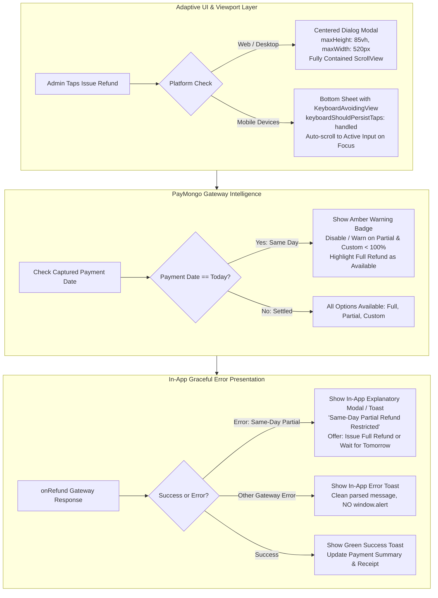

# Implementation Plan: Custom Admin Refund & Financial Protection System

## 1. Executive Summary

This document outlines the architectural plan for implementing **Admin-Controlled Custom Refunds** in the payment system. It resolves identified system discrepancies, answers all architectural safety questions, and introduces robust financial guardrails (idempotency, distributed locking, double-click protection, and gateway error handling) to protect both the admin and the customer.

> [!WARNING]
> **Current Status: PENDING LIVE TESTING & MANUAL CLOUD DEPLOYMENT**
> All code changes, backend functions, and UI modifications documented herein are **UNTESTED in live production/staging environments and are currently PENDING**. 
> - Backend Cloud Functions have **not** been deployed to Firebase.
> - Live gateway transactions with real PayMongo accounts have **not** been executed.
> - Cross-window popup auto-close handshakes and mobile deep-link returns have **not** been tested in live end-to-end user workflows.
> - User-side booking double-click prevention protections have been implemented in code, pending physical device/browser verification.

---

## 2. Answers to Double-Checking Questions

### Q1: Is the custom refund the exact amount or a percentage?
* **Primary Value**: **Exact Amount in Philippine Pesos (PHP)**.
* **Why**: PayMongo's Gateway API ([`PayMongoProvider.js`](file:///d:/thrail_app/functions/services/providers/PayMongoProvider.js#L164)) processes refunds in exact centavos (`Math.round(amount * 100)`). Admins frequently need to refund specific sums (e.g., deducting an environmental fee of ₱150, retaining a non-refundable deposit, or reimbursing a specific charge).
* **UI Convenience**: While the transaction is executed as an **exact amount**, the UI will provide:
  * An exact currency text input (with `₱` prefix).
  * Real-time calculation showing the equivalent percentage of the total paid (e.g., `₱750.00 = 50.0%`).
  * Quick percentage preset buttons (`25%`, `50%`, `75%`) that immediately calculate and populate the exact PHP amount.

### Q2: Does the user see that option? (It shouldn't)
* **Frontend Isolation**: **No, regular users never see this option.**
  * The refund modal ([`AdminRefundModal.tsx`](file:///d:/thrail_app/src/features/Admin/screens/Booking/components/AdminRefundModal.tsx)) is exclusively imported and rendered inside [`ReviewScreen.tsx`](file:///d:/thrail_app/src/features/Admin/screens/Booking/ReviewScreen.tsx#L614), which is mounted only on the admin route ([`src/app/(app)/(main)/admin/booking/view.tsx`](file:///d:/thrail_app/src/app/(app)/(main)/admin/booking/view.tsx)).
  * Customer cancellation in [`BookingDetailsScreen.tsx`](file:///d:/thrail_app/src/features/Book/screens/MyBookings/BookingDetailsScreen.tsx#L682) uses `ReasonModal`, which only prompts for a text reason.
* **Backend Security Guard**:
  * Even if a malicious user inspects network traffic and calls [`refundBooking`](file:///d:/thrail_app/functions/index.js#L1014) directly with a `customAmount` payload, the Cloud Function strictly validates caller claims:
    ```javascript
    const adminBusinessId = caller.token.businessId || caller.token.owner;
    const isAdmin = caller.token.role === 'admin' && adminBusinessId === data.business.id;
    const isSuperAdmin = caller.token.role === 'superadmin';
    if (!isAdmin && !isSuperAdmin) {
        // Disallow customAmount completely. Force regular policy (10% max) or reject.
    }
    ```
  * Any `customAmount` submitted by a non-admin is strictly ignored or rejected with `permission-denied`.

### Q3: Does it have proper rate limiting and double-click protection? What happens if internet is slow and the button is clicked twice?
* **Current Vulnerability (Critical Finding)**:
  * **Frontend**: There is currently no double-click debounce or loading lock on [`AdminRefundModal`](file:///d:/thrail_app/src/features/Admin/screens/Booking/components/AdminRefundModal.tsx).
  * **Backend**: There is currently **no database lock or idempotency check** in [`refundBooking`](file:///d:/thrail_app/functions/index.js#L1014-L1093). If two requests arrive concurrently during a slow network burst, both read `status === 'captured'`, both invoke `issueRefund` with PayMongo, and PayMongo **issues two refunds**, deducting funds twice from the organizer's merchant account.
* **Target Protection Architecture**:
  * **Frontend Guard (Double-Click Prevention)**:
    1. Immediate UI state lock: On press, set `isSubmitting = true`, show spinner, and disable all buttons.
    2. Synchronous ref guard (`isSubmittingRef.current = true`) to prevent rapid consecutive touch events before the React re-render cycle completes.
  * **Backend Distributed Mutex Lock (Firestore Atomic Transaction)**:
    1. Before dispatching the HTTP request to PayMongo, perform an atomic Firestore transaction to check if payment is already in `processing_refund` or `refunded`.
    2. Set `capturedPayment.status = 'processing_refund'` and record `capturedPayment.refundLockUntil = serverTimestamp() + 60s`.
    3. If a second duplicate request arrives while the first is calling PayMongo, it immediately aborts with `failed-precondition: A refund is already being processed for this booking`.
    4. Call PayMongo API.
    5. If PayMongo succeeds: Mark status as `refunded` and record `refundedAmount`.
    6. If PayMongo fails: Revert status back to `captured` so the admin can safely retry.

---

## 3. Comprehensive Edge Cases & Safeguards

| # | Edge Case | Potential Danger | Guard / Solution |
|---|---|---|---|
| 1 | **Double-Click / Slow Network** | Duplicate gateway refund & double payout from merchant account. | Frontend ref lock + Backend two-phase Firestore status lock (`processing_refund`). |
| 2 | **Same-Day Partial Refund (PayMongo restriction)** | PayMongo throws `same_day_partial_refund_not_allowed` error. | 1. Detect if `capturedPayment.createdAt` is same calendar day.<br>2. Modal shows warning advice.<br>3. Cloud function catches specific error code and returns actionable message advising admin to issue 100% full refund or wait until tomorrow. |
| 3 | **Amount Exceeding Original Payment** | Financial loss exceeding booking value. | 1. Client-side input validation (`customAmount <= amountPaid`).<br>2. Server-side validation rejecting any `amount > capturedPayment.amount`. |
| 4 | **Zero, Negative, or NaN Amounts** | Invalid PayMongo payload / crash. | Validate `customAmount >= 1.00` (PayMongo minimum refund threshold) and enforce numeric sanitization. |
| 5 | **Floating Point Centavo Inaccuracies** | Rounding bugs (e.g. `0.1 + 0.2 = 0.30000000000000004`). | Explicit rounding before centavo conversion: `Math.round(Number(customAmount) * 100) / 100` and `Math.round(amount * 100)` for centavos. |
| 6 | **Partial Refund vs. Cancellation Status** | Booking status prematurely marked `cancelled` for partial refund adjustments. | Document and verify whether partial refunds should mark booking as `cancelled` (current policy) or retain active status if agreed upon. Default to current system policy: marks booking as `cancelled`. |
| 7 | **Discrepancy in Existing Hook** | Hook sends `50` for partial; backend checks for `10` or `'partial'`, falling back to 10%. | Harmonize `usePaymentAdmin.ts` and `functions/index.js` to ensure the exact desired percentage or custom amount is passed and applied. |
| 8 | **Insufficient Gateway Merchant Balance** | PayMongo API returns error if merchant account has insufficient balance to refund. | Catch error gracefully, revert Firestore lock, and display descriptive message to admin without corrupting booking state. |

---

## 4. Technical Specification

### A. Backend: [`functions/index.js`](file:///d:/thrail_app/functions/index.js)

```javascript
// Data Payload Contract
{
    bookingId: string,
    userId: string,
    reason?: string,
    refundPercentage?: 'full' | 'partial' | number,
    customAmount?: number // Admin-only: exact PHP amount
}
```

#### Detailed Execution Steps:
1. **Authentication & Authorization**:
   - Check `caller.token.role === 'admin'` and verify business ID match.
   - If `customAmount` is supplied and caller is not admin/superadmin, throw `HttpsError('permission-denied')`.
2. **Atomic Pre-Locking via Firestore Transaction**:
   - Query `capturedPayment`. Verify `status === 'captured'` and not locked.
   - Atomically update `status = 'processing_refund'` and `refundStartedAt = FieldValue.serverTimestamp()`.
3. **Amount Determination**:
   - If `isAdmin && customAmount > 0`:
     - Enforce `customAmount <= capturedPayment.amount`.
     - `refundAmount = Math.round(customAmount * 100) / 100`.
   - Else determine by `refundPercentage` (100% full or 10% partial standard).
4. **Call PayMongo**:
   - Call `PaymentManager.getProvider('paymongo').issueRefund(gatewayId, refundAmount, sanitizedReason)`.
5. **Success Commit**:
   - Set `capturedPayment.status = 'refunded'`.
   - Set `capturedPayment.refundedAmount = refundAmount`.
   - Set `booking.status = 'cancelled'`.
   - Add activity log record.
6. **Error Recovery**:
   - In `catch`, rollback `capturedPayment.status = 'captured'` and remove lock.
   - Translate `same_day_partial_refund_not_allowed` into clear guidance.

---

### B. Core Types & Hook: [`usePaymentAdmin.ts`](file:///d:/thrail_app/src/core/models/Payment/hooks/usePaymentAdmin.ts)

1. **Updated Types**:
   ```typescript
   export type RefundType = 'full' | 'partial' | 'custom';

   export interface RefundOptions {
       type: RefundType;
       customAmount?: number;
       reason?: string;
   }
   ```
2. **Updated `onRefund` Function**:
   - Accept `(booking: Booking, refundType: RefundType, customAmount?: number)`.
   - Implement local `isRefunding` loading state.
   - Maintain backward compatibility with [`useCancellationAdmin.ts`](file:///d:/thrail_app/src/core/models/Cancellation/hooks/useCancellationAdmin.ts#L88) where `onRefund(updatedBooking, 'full')` is called.

---

### C. UI Component: [`AdminRefundModal.tsx`](file:///d:/thrail_app/src/features/Admin/screens/Booking/components/AdminRefundModal.tsx)

1. **Visual Hierarchy**:
   - Header with title "Select Refund Amount" and close button.
   - 3 Cards:
     1. **Full Refund (100%)** — `₱{amountPaid.toFixed(2)}`
     2. **Standard Partial Refund (10%)** — `₱{(amountPaid * 0.10).toFixed(2)}`
     3. **Custom Amount** — Interactive selection.
2. **Custom Amount Panel (when Custom is active)**:
   - Currency text field with `₱` prefix and clear decimal keypad.
   - 3 Quick preset chips: `[25%]`, `[50%]`, `[75%]`.
   - Dynamic breakdown text: `"₱X.XX will be refunded (Y% of ₱Z.ZZ)"`.
   - PayMongo Same-Day Notice box (subtle info alert): *"Partial refunds on payments made today may be restricted by the payment gateway."*
   - Inline error message if amount is invalid, 0, or exceeds total paid.
3. **Submit Button**:
   - Prominent button: `"Confirm Refund of ₱{amount.toFixed(2)}"`.
   - Disabled while invalid or while `isSubmitting === true`.
   - Shows `ActivityIndicator` during API call.

---

### D. Controller Component: [`ReviewScreen.tsx`](file:///d:/thrail_app/src/features/Admin/screens/Booking/ReviewScreen.tsx)

1. Update `ReviewScreenProps.onRefund`:
   ```typescript
   onRefund: (booking: Booking, refundType: RefundType, customAmount?: number) => Promise<Booking | undefined | void> | void;
   ```
2. Wire `onSelect={(refundType, customAmount) => ...}` to invoke `onRefund(booking, refundType, customAmount)`.

---

## 5. Verification Matrix

| Test Scenario | Input / Action | Expected Result |
|---|---|---|
| **Full Refund** | Select Full (100%) | Issues 100% refund, marks status as `refunded`, booking `cancelled`. |
| **Standard Partial** | Select Partial (10%) | Issues 10% refund, correctly records `refundedAmount = amount * 0.10`. |
| **Custom Amount (Valid)** | Enter `₱500.00` on a ₱1,500 booking | Issues ₱500 refund, displays `(33%)` in payment tab, updates Firestore. |
| **Custom Amount (Presets)** | Tap `50%` chip | Auto-fills half of total paid, updates dynamic label. |
| **Custom Amount (Exceeds Max)** | Enter `₱2,000` on ₱1,500 booking | Disables Confirm button, shows error `"Amount cannot exceed ₱1,500.00"`. |
| **Custom Amount (Zero/Negative)** | Enter `₱0.00` or `-50` | Disables Confirm button, shows error `"Minimum refund is ₱1.00"`. |
| **Double Click Simulation** | Rapidly tap "Confirm Refund" twice | First tap sets `isSubmitting = true`, second tap ignored by ref guard. Backend lock rejects duplicates. |
| **Same-Day Partial Rejection** | Attempt partial refund on same-day payment | Graceful catch of PayMongo error; clear prompt to try 100% or wait until tomorrow; database lock reverts to `captured`. |
| **Regular User Privilege Escalation** | Call `refundBooking` with `customAmount` as non-admin | Cloud Function throws `permission-denied`. |
| **Web Popup Redirect** | Complete GCash/Maya payment in Web popup | Popup window automatically closes; original browser tab navigates to `/book/list` with verified status. |
| **Mobile Native Auth Session** | Complete payment in Mobile in-app browser | In-app browser dismisses via `thrailapp://` deep link; app resumes seamlessly. |
| **Manual Popup Close** | User manually closes popup before paying | Main window detects closure and displays helpful retry message without getting stuck. |

---

## 6. Payment Popup Browser Redirect Fix (Web Opener Handshake)

### A. Root Cause Analysis
* **Mechanism in Web Browser**:
  * In [`PaymentScreen.tsx`](file:///d:/thrail_app/src/features/Book/screens/Payment/PaymentScreen.tsx#L139), payments on Web open a dedicated popup window via `window.open('', 'PayMongoCheckout', 'width=450,height=750...')`.
  * The return URL sent to PayMongo points to [`paymongoRedirect`](file:///d:/thrail_app/functions/index.js#L776) with `?url=${encodeURIComponent(appUrl)}`.
  * When payment completes, PayMongo redirects the **popup window** to the Cloud Function proxy.
* **The Glitch**:
  * [`paymongoRedirect`](file:///d:/thrail_app/functions/index.js#L787-L803) currently outputs an HTML script that executes:
    ```javascript
    window.location.href = "${targetUrl}";
    ```
  * Because this executes **inside the popup window**, the popup window redirects itself to the app URL (`http://localhost:8081/book/list...`).
  * As a result, the entire application mounts inside the small 450x750 popup window, while the original browser tab remains stuck waiting or polling `popup.closed` (which is never true since the popup is still open running the newly navigated app).

### B. Solution: Window Opener Handshake & Auto-Close
To ensure the popup closes automatically and redirects the original browser window:

1. **Update [`paymongoRedirect`](file:///d:/thrail_app/functions/index.js#L776)**:
   * Enhance the proxy HTML script to detect whether it is executing inside a child popup window (`window.opener && !window.opener.closed`).
   * **If `window.opener` exists (Web popup flow)**:
     1. Post a cross-window message: `window.opener.postMessage({ type: 'PAYMONGO_PAYMENT_SUCCESS', url: target }, '*')`.
     2. Instruct the parent window to navigate directly: `window.opener.location.href = target`.
     3. Close the popup window automatically via `window.close()`.
   * **If `window.opener` is null/undefined (Mobile native flow using `WebBrowser.openAuthSessionAsync`)**:
     * Retain standard behavior: navigate `window.location.href = target` to invoke the `thrailapp://` OS deep-link scheme, allowing Expo's auth session to dismiss cleanly.

2. **Update [`PaymentScreen.tsx`](file:///d:/thrail_app/src/features/Book/screens/Payment/PaymentScreen.tsx)**:
   * Add a `postMessage` listener on Web:
     ```typescript
     useEffect(() => {
         if (Platform.OS !== 'web') return;
         const handleMessage = (event: MessageEvent) => {
             if (event.data?.type === 'PAYMONGO_PAYMENT_SUCCESS') {
                 if (popupRef.current && !popupRef.current.closed) {
                     popupRef.current.close();
                 }
                 setIsWaitingForVerification(false);
                 router.replace('/book/list?bookingId=' + bookingData?.id + '&view=overview');
             }
         };
         window.addEventListener('message', handleMessage);
         return () => window.removeEventListener('message', handleMessage);
     }, [bookingData?.id]);
     ```
   * Store `popup` in a ref (`popupRef`) so cleanup and message handling can reliably close the window without relying solely on timer polling.

---

## 7. Implementation Checklist & Progress

- [x] **Backend: Custom Refund Support & Authorization Guard**
  - Updated [`refundBooking`](file:///d:/thrail_app/functions/index.js#L1035) in [`functions/index.js`](file:///d:/thrail_app/functions/index.js) to accept `customAmount`.
  - Added role verification ensuring only `admin` / `superadmin` can specify `customAmount`.
- [x] **Backend: Idempotency & Concurrency Mutex Lock**
  - Implemented in-flight status check (`processing_refund`).
  - Added pre-call state transition to prevent double-refund race conditions.
  - Implemented automated rollback to `captured` in `catch` blocks if gateway fails.
- [x] **Backend: Bounds & Precision Sanitization**
  - Added bounds enforcement: `1.00 <= customAmount <= capturedPayment.amount`.
  - Rounded amounts to 2 decimal places and exact centavos for PayMongo.
  - Added friendly guidance for PayMongo's `same_day_partial_refund_not_allowed`.
- [x] **Backend: Payment Popup Redirect Proxy Fix**
  - Updated [`paymongoRedirect`](file:///d:/thrail_app/functions/index.js#L776) in [`functions/index.js`](file:///d:/thrail_app/functions/index.js) to detect `window.opener`.
  - Added `postMessage` notification, parent redirect, and `window.close()` for Web popup flow.
  - Preserved deep-link scheme execution (`thrailapp://`) for native mobile in-app browser.
- [x] **Frontend Hook: `usePaymentAdmin`**
  - Updated [`usePaymentAdmin.ts`](file:///d:/thrail_app/src/core/models/Payment/hooks/usePaymentAdmin.ts) signature to `onRefund(booking, refundType, customAmount)`.
  - Fixed partial percentage discrepancy to pass `10` instead of `50`.
  - Added `isRefunding` loading state.
- [x] **Frontend UI: `AdminRefundModal`**
  - Redesigned [`AdminRefundModal.tsx`](file:///d:/thrail_app/src/features/Admin/screens/Booking/components/AdminRefundModal.tsx) with 3 choices: Full (100%), Partial (10%), and Custom Amount.
  - Added quick preset percentage chips (`25%`, `50%`, `75%`).
  - Added currency input with real-time percentage and amount feedback.
  - Added client-side bounds validation and PayMongo same-day warning notice.
  - Added ref guard (`isSubmittingRef`) to eliminate client double-click race conditions.
- [x] **Frontend Controller: `ReviewScreen`**
  - Updated [`ReviewScreen.tsx`](file:///d:/thrail_app/src/features/Admin/screens/Booking/ReviewScreen.tsx) props and wired custom refund callback.
- [x] **Frontend Client: Payment Return Listener**
  - Added `postMessage` listener and `popupRef` in [`PaymentScreen.tsx`](file:///d:/thrail_app/src/features/Book/screens/Payment/PaymentScreen.tsx) to close the popup tab and navigate the main tab.
- [x] **Automated Test Suite: Cloud Functions ([`paymentFunctions.test.js`](file:///d:/thrail_app/functions/__tests__/paymentFunctions.test.js))**
  - Full suite testing `paymongoRedirect` (web popup handshake, mobile fallback, 400 validation).
  - Full suite testing `refundBooking` (unauthenticated, not-found, in-flight mutex lock, unauthorized users, privilege escalation, bounds checks, custom amount execution, full refund, 10% partial refund, error rollback, and same-day error mapping).
- [x] **Automated Test Suite: Frontend Hook ([`usePaymentAdmin.test.ts`](file:///d:/thrail_app/src/core/models/Payment/hooks/__tests__/usePaymentAdmin.test.ts))**
  - Full suite testing `usePaymentAdmin` (custom amount payload, 100% full, 10% partial, admin-only role enforcement, and error state handling).
- [x] **User-Side Booking Double-Click & Rapid-Tap Hardening**
  - **Payment Flow ([`PaymentScreen.tsx`](file:///d:/thrail_app/src/features/Book/screens/Payment/PaymentScreen.tsx))**: Added synchronous ref guard (`isSubmittingRef`), disabled state in `footerConfig` during submission, and passed `isLoading` to primary button.
  - **Reservation Flow ([`DetailsScreen.tsx`](file:///d:/thrail_app/src/features/Book/screens/Booking/DetailsScreen.tsx) & [`BookingScreen.tsx`](file:///d:/thrail_app/src/features/Book/screens/Booking/BookingScreen.tsx))**: Added synchronous confirmation lock (`isConfirmingRef`), `isSubmitting` entry guards, and passed `isLoading` to `ConfirmationModal` and `CustomStickyFooter`.
  - **Cancellation Flow ([`CancelBookingModal.tsx`](file:///d:/thrail_app/src/features/Book/screens/MyBookings/components/CancelBookingModal.tsx))**: Added synchronous ref lock (`isSubmittingRef`) to prevent rapid consecutive touch events from sending duplicate `cancelBooking` or `refundBooking` calls.
  - **Reschedule Flow ([`RescheduleModal.tsx`](file:///d:/thrail_app/src/features/Book/screens/MyBookings/components/RescheduleModal.tsx) & [`BookingDetailsScreen.tsx`](file:///d:/thrail_app/src/features/Book/screens/MyBookings/BookingDetailsScreen.tsx))**: Added `isSubmitting` state, synchronous ref locks (`isSubmittingRef` and `isReschedulingRef`), disabled state, and loading spinner.
  - **App-Wide Base Component ([`CustomButton.tsx`](file:///d:/thrail_app/src/components/CustomButton.tsx))**: Built-in 500ms press debounce/throttle by default to prevent accidental double-taps app-wide.

---

## 8. Manual Cloud Deployment Instructions

> [!NOTE]
> Per user instruction, backend Cloud Functions have **not** been deployed automatically. Please deploy them manually to Firebase when ready.

To deploy the updated backend functions (`refundBooking` and `paymongoRedirect`), run the following command from the `functions/` directory or root workspace:

```bash
cd functions
firebase deploy --only functions:refundBooking,functions:paymongoRedirect
```
*(Or `firebase deploy --only functions` to deploy all functions).*

---

## 9. Current Testing & Verification Status: PENDING LIVE TESTING

> [!CAUTION]
> **Status: All feature updates are currently UNTESTED in live environments and remain PENDING.**
> 
> Although automated unit tests passed in local mock environments (17 Cloud Function tests in [`paymentFunctions.test.js`](file:///d:/thrail_app/functions/__tests__/paymentFunctions.test.js) and 5 hook tests in [`usePaymentAdmin.test.ts`](file:///d:/thrail_app/src/core/models/Payment/hooks/__tests__/usePaymentAdmin.test.ts)), no updates have been deployed to cloud infrastructure or verified against live payment services.

### Detailed Breakdown of Pending Verification Items:

| Area | Status | Description |
| :--- | :--- | :--- |
| **Cloud Deployment** | ⏳ **Pending** | [`refundBooking`](file:///d:/thrail_app/functions/index.js#L1035) and [`paymongoRedirect`](file:///d:/thrail_app/functions/index.js#L776) are only committed to the local repository branch (`raven-add-custom-refund-amount`). They have **not** been deployed to Firebase Cloud Functions. |
| **PayMongo Gateway Live Refunds** | ⏳ **Pending** | Live refund execution against real or test PayMongo API credentials has **not** been tested. Real-world balance deduction, centavo accuracy, and live webhook lifecycle responses remain untested in production/staging. |
| **Web Popup Auto-Close & Navigation Handshake** | ⏳ **Pending** | The `window.opener.postMessage` cross-window handshake between the PayMongo redirect proxy and [`PaymentScreen.tsx`](file:///d:/thrail_app/src/features/Book/screens/Payment/PaymentScreen.tsx) has **not** been tested across live web browsers (Chrome, Edge, Safari, Firefox). Real popup closure and parent tab refresh are pending live verification. |
| **Mobile Native Deep-Link Handshake** | ⏳ **Pending** | Native Expo `WebBrowser.openAuthSessionAsync` deep-link returns (`thrailapp://`) with the updated proxy have **not** been verified on physical iOS or Android devices. |
| **User-Side Booking Double-Click Prevention** | ⏳ **Pending Live Device/Browser Testing** | Protections implemented across [`PaymentScreen.tsx`](file:///d:/thrail_app/src/features/Book/screens/Payment/PaymentScreen.tsx), [`DetailsScreen.tsx`](file:///d:/thrail_app/src/features/Book/screens/Booking/DetailsScreen.tsx), [`BookingScreen.tsx`](file:///d:/thrail_app/src/features/Book/screens/Booking/BookingScreen.tsx), [`CancelBookingModal.tsx`](file:///d:/thrail_app/src/features/Book/screens/MyBookings/components/CancelBookingModal.tsx), [`RescheduleModal.tsx`](file:///d:/thrail_app/src/features/Book/screens/MyBookings/components/RescheduleModal.tsx), [`BookingDetailsScreen.tsx`](file:///d:/thrail_app/src/features/Book/screens/MyBookings/BookingDetailsScreen.tsx), and [`CustomButton.tsx`](file:///d:/thrail_app/src/components/CustomButton.tsx). End-to-end multi-tap verification on physical touch screens and web browsers is pending manual testing. |

---

## 10. Live Gateway Investigation & Architectural Resolution (PayMongo CloudFront 403 & Completed Bookings)

### A. Incident Report: PayMongo CloudFront 403 Error
During live testing on `thrail.web.app`, issuing a full refund failed with a CloudFront 403 HTML block:
> `FirebaseError: Payment Gateway Error: PayMongo Refund Error: 403 ERROR The request could not be satisfied. Request blocked... Generated by cloudfront`

#### Root Cause Analysis:
1. **RFC 7617 HTTP Basic Authentication Formatting**:
   - In [`PayMongoProvider.js`](file:///d:/thrail_app/functions/services/providers/PayMongoProvider.js), the secret key was encoded as `Buffer.from(this.secretKey).toString('base64')`.
   - Under RFC 7617 and PayMongo API specifications, Basic Auth requires `username:password`. Because PayMongo uses the secret key as the username with an empty password, the string to encode must be `${secretKey}:` (with a trailing colon). Without this colon, edge proxies reject the authorization header.
2. **Missing Standard HTTP Client Headers (`User-Agent` & `Accept`)**:
   - Node.js native `fetch()` sends no `User-Agent` header by default.
   - Amazon CloudFront's Web Application Firewall (AWS WAF) rules on `api.paymongo.com` block automated HTTP requests lacking an identifiable `User-Agent` header (`NoUserAgent_Header` rule), rejecting requests before they reach the PayMongo application.
3. **Raw HTML Error Dumps**:
   - When a network or edge proxy error occurred, the provider executed `throw new Error('PayMongo Refund Error: ' + await response.text())`, leaking raw HTML error markup into client-facing alert modals.
4. **Payment Identifier Validation (`pay_...` vs `bal_txn_...`)**:
   - PayMongo's `/v1/refunds` API requires a Payment resource ID (`pay_...`). Older bookings or test data containing balance transaction IDs (`bal_txn_...`) trigger invalid argument errors if not resolved.

---

### B. Architectural Refactoring: Centralized `PayMongoProvider` Client

Rather than applying ad-hoc header patches, [`PayMongoProvider.js`](file:///d:/thrail_app/functions/services/providers/PayMongoProvider.js) is refactored into a standardized, RFC-compliant API client:

1. **Centralized HTTP Client Pipeline (`_request`)**:
   - Single private method for all PayMongo REST calls (`/checkout_sessions`, `/refunds`).
   - Automatically injects RFC-compliant Basic Auth (`Buffer.from(`${this.secretKey}:`).toString('base64')`).
   - Standardizes headers across all calls: `Accept: application/json`, `Content-Type: application/json`, and `User-Agent: ThrailApp-Backend/1.0 (Firebase-Cloud-Functions)`.
2. **Structured Error Sanitization**:
   - Parses JSON errors returned by PayMongo to extract `detail` and `code` messages (e.g. *"Insufficient merchant balance"*, *"Payment already refunded"*).
   - Gracefully translates edge proxy / CloudFront errors (403, 502) into clean human-readable messages, completely eliminating HTML dumps in UI alerts.
3. **Pre-flight Parameter Validation & Self-Healing**:
   - In [`issueRefund`](file:///d:/thrail_app/functions/services/providers/PayMongoProvider.js), enforces `payment_id.startsWith('pay_')`.
   - In [`refundBooking`](file:///d:/thrail_app/functions/index.js), if a booking only contains a `sessionId` or `bal_txn_`, automatically resolves the true `pay_...` ID from the checkout session before dispatching.

---

### C. Completed Booking Policy: Only Refund Unlocked (Reschedule & Cancel Kept Original)

#### Business Rule & Problem:
When an admin marks a hike as completed (`currentStatus === 'completed'`), the booking is in a post-event state.
- Previously, [`ReviewScreen.tsx`](file:///d:/thrail_app/src/features/Admin/screens/Booking/ReviewScreen.tsx#L960) passed `isCancelledStatus={isCancelledStatus || currentStatus === 'completed'}`, locking all admin actions.
- However, financial adjustments or post-event dispute resolutions frequently require the ability to **Issue a Refund** even after an expedition concludes (e.g. partial reimbursement for weather cut short, medical incident, or customer complaint).

#### Policy & Safety Decisions:
1. **Issue Refund (UNLOCKED on Completed)**:
   - Accessible on `completed` bookings as long as payments were captured (`totalAmountPaid > 0`).
   - Admins can issue partial or full refunds with an audit reason securely processed through PayMongo.
2. **Reschedule Booking (ORIGINAL BEHAVIOR - Locked on Completed)**:
   - Kept strictly for active/upcoming bookings (`!isCancelledStatus && !isCompletedStatus`).
   - Rationale: Completed hikes cannot be rescheduled back into future slots without corrupting slot availability counters, attendee rosters, and event auditing history.
3. **Cancel Booking (ORIGINAL BEHAVIOR - Locked on Completed & Unpaid Only)**:
   - Kept strictly for active, unpaid bookings (`!isCancelledStatus && !isCompletedStatus && totalAmountPaid === 0 && !hasPendingCancellation`).
   - Rationale: Completed bookings cannot be cancelled without refunding; if funds were captured, the admin must use "Issue Refund" rather than an unrefunded cancellation.
4. **Implementation Details**:
   - [`ReviewScreen.tsx`](file:///d:/thrail_app/src/features/Admin/screens/Booking/ReviewScreen.tsx): Decoupled `currentStatus === 'completed'` from `isCancelledStatus` and explicitly passed `isCompletedStatus={currentStatus === 'completed'}` to [`AdminActionMenu`](file:///d:/thrail_app/src/features/Admin/screens/Booking/components/AdminActionMenu.tsx).
   - [`AdminActionMenu.tsx`](file:///d:/thrail_app/src/features/Admin/screens/Booking/components/AdminActionMenu.tsx):
     - `canReschedule = !isCancelledStatus && !isCompletedStatus`
     - `canCancel = !isCancelledStatus && !isCompletedStatus && totalAmountPaid === 0 && !hasPendingCancellation`
     - `canRefund = !isCancelledStatus && totalAmountPaid > 0`
   - [`useBookingAdmin.ts`](file:///d:/thrail_app/src/core/models/Booking/hooks/useBookingAdmin.ts): Retained in its original pristine state without any schema-altering persistence hacks.

---

## 11. UI Responsiveness, Mobile Keyboard Handling & Same-Day Refund Policy Architecture

### A. Problem Statement & Incident Analysis

#### 1. Web / Desktop Layout Responsiveness (Modal Cut-Off)
* **Observed Defect**: On non-maximized browser windows, laptop displays, and standard desktop screens, [`AdminRefundModal.tsx`](file:///d:/thrail_app/src/features/Admin/screens/Booking/components/AdminRefundModal.tsx) cuts off the "Confirm Refund" button and bottom controls when the "Custom Amount" dropdown is expanded.
* **Root Cause**:
  - The modal uses a mobile-centric bottom-sheet structure (`justifyContent: 'flex-end'`) even on web/desktop viewports.
  - The modal outer wrapper is constrained to `maxHeight: '90%'`, but inner containers lack flexible scroll containment (`flexGrow: 0, flexShrink: 1`), causing content to extend beyond the visible browser canvas unless the user manually maximizes their browser window.

#### 2. Mobile Keyboard Occlusion (Hidden Amount Input)
* **Observed Defect**: On mobile devices (Android / iOS), tapping the "Custom Amount" text input opens the virtual decimal/number pad. The keyboard slides up and completely covers the text input, preset percentage chips, warning notice, and "Confirm Refund" button. The admin is unable to see what numbers they are typing.
* **Root Cause**:
  - [`AdminRefundModal.tsx`](file:///d:/thrail_app/src/features/Admin/screens/Booking/components/AdminRefundModal.tsx) does not implement `KeyboardAvoidingView` or keyboard offset calculations.
  - The inner `ScrollView` lacks `keyboardShouldPersistTaps="handled"` and has no auto-scroll mechanism to shift the focused input into the active visible viewport above the virtual keyboard.

#### 3. PayMongo Same-Day Partial Refund Gateway Rule
* **Observed Defect**: Attempting a partial refund on a newly created booking triggers a gateway rejection:
  > `FirebaseError: Payment Gateway Error: PayMongo API Error: Cannot partially refund for payments done on the same day..`
* **Underlying Gateway Mechanics**:
  - PayMongo settles credit card and e-wallet transactions in daily batches at the end of each calendar day (00:00 UTC / 08:00 Philippine Time).
  - Before settlement occurs, a transaction is uncaptured/unsettled. PayMongo allows **100% Full Refunds (Void)** on the same day.
  - PayMongo **strictly rejects partial refunds (< 100%)** on the same calendar day that the transaction was captured. Partial refunds can only be processed **on the following calendar day (after settlement)**.
* **Deficiency**: The admin dashboard currently provides no upfront guidance explaining this rule, leading admins to believe the feature is broken when a partial refund fails on the day of payment.

#### 4. Intrusive Browser Alert Popups (`thrail.web.app says`)
* **Observed Defect**: When the same-day partial refund error occurred, the browser popped up a raw developer notification:
  > `thrail.web.app says`  
  > `Task Required`  
  > `Error caught; access 'writingError' via 'onRefund()'`  
  > `FirebaseError: Payment Gateway Error: PayMongo API Error: Cannot partially refund for payments done on the same day.. Update the UI to properly catch the error. This warning is for development only, the error will cause a crash if unhandled in production code.`
* **Root Cause**:
  - [`usePaymentAdmin.ts`](file:///d:/thrail_app/src/core/models/Payment/hooks/usePaymentAdmin.ts#L54) wraps the refund call with `catchError(error, 'writingError', 'onRefund()')`. In [`errorFormatter.ts`](file:///d:/thrail_app/src/core/utility/errorFormatter.ts#L13), `catchError` defaults to triggering `window.alert(...)` on web platforms.
  - [`ReviewScreen.tsx`](file:///d:/thrail_app/src/features/Admin/screens/Booking/ReviewScreen.tsx#L941) lacked local `try...catch` error presentation and had no dedicated modal or toast handling for expected gateway business rules.

---

### B. Proposed Solution & Architecture



---

### C. Detailed Component Specifications

#### 1. Adaptive & Responsive Modal Layout ([`AdminRefundModal.tsx`](file:///d:/thrail_app/src/features/Admin/screens/Booking/components/AdminRefundModal.tsx))

* **Web / Desktop Centered Card**:
  - Detect viewport: `const isDesktop = width >= 768 || Platform.OS === 'web'`.
  - On desktop viewports, configure overlay and container:
    ```typescript
    overlay: {
        justifyContent: isDesktop ? 'center' : 'flex-end',
        alignItems: 'center',
        padding: isDesktop ? 20 : 0,
    },
    modalContainer: {
        width: '100%',
        maxWidth: 520,
        maxHeight: isDesktop ? '85vh' : '90%',
        borderRadius: isDesktop ? 24 : 0,
        borderTopLeftRadius: 24,
        borderTopRightRadius: 24,
        overflow: 'hidden',
    }
    ```
  - This guarantees the modal is cleanly centered on laptops and desktops, eliminating the bottom cut-off regardless of browser window scaling.

* **Mobile Keyboard Handling (Android Priority & iOS Forward-Compatibility)**:
  - **The Mobile Architecture Challenge**:
    - **Android (Active Platform Tested)**: Inside a React Native transparent `<Modal>`, Android's native `windowSoftInputMode="adjustResize"` fails to resize the modal sub-window by default. As shown in the user's Android screenshot, the virtual keyboard overlays directly onto the bottom-sheet without shifting the content.
    - **iOS (Forward Compatibility)**: Requires `behavior="padding"` and explicit `keyboardVerticalOffset` to prevent status bar and notch misalignments.
  - **Dual-Platform Architecture Solution**:
    ```tsx
    <KeyboardAvoidingView
        behavior={Platform.OS === 'ios' ? 'padding' : 'height'}
        keyboardVerticalOffset={Platform.OS === 'ios' ? 64 : 0}
        style={styles.keyboardAvoid}
    >
        <ScrollView
            ref={scrollViewRef}
            keyboardShouldPersistTaps="handled"
            keyboardDismissMode="interactive"
            automaticallyAdjustKeyboardInsets={true}
            showsVerticalScrollIndicator={false}
            contentContainerStyle={styles.scrollContent}
        >
            ...
        </ScrollView>
    </KeyboardAvoidingView>
    ```
  - **Android & iOS Interactive Viewport Auto-Scroll**:
    - Attach an `onFocus` listener to the custom amount `TextInput`:
      ```typescript
      onFocus={() => {
          // Allow keyboard animation frame to initiate before scrolling
          setTimeout(() => {
              scrollViewRef.current?.scrollToEnd({ animated: true });
          }, Platform.OS === 'android' ? 200 : 100);
      }}
      ```
    - Android back-button support: Bind `onRequestClose={onClose}` on `<Modal>` so physical/gesture back button cleanly dismisses the modal or keyboard.
    - Result: On Android (and iOS), the custom amount input, preset chips, and confirm button remain completely visible and centered above the virtual keyboard.

#### 2. PayMongo Same-Day Detection in Modal ([`AdminRefundModal.tsx`](file:///d:/thrail_app/src/features/Admin/screens/Booking/components/AdminRefundModal.tsx))

* **Props Enhancement**: Pass `paymentCapturedAt?: Date | string | null` to `AdminRefundModal`.
* **Same-Day Computation**:
  ```typescript
  const isCapturedToday = useMemo(() => {
      if (!paymentCapturedAt) return false;
      const paymentDate = new Date(paymentCapturedAt);
      const now = new Date();
      return (
          paymentDate.getFullYear() === now.getFullYear() &&
          paymentDate.getMonth() === now.getMonth() &&
          paymentDate.getDate() === now.getDate()
      );
  }, [paymentCapturedAt]);
  ```
* **Proactive UI Behavior**:
  - When `isCapturedToday === true`:
    - The "Partial Refund (10%)" card displays a subtle warning badge: `Available Tomorrow (Unsettled)`.
    - If the admin selects "Custom Amount" and enters less than 100%, an inline warning alert explicitly informs:
      > *"PayMongo Policy: This payment was captured today and has not settled yet. Only a 100% Full Refund can be processed today. Partial refunds will become available tomorrow after gateway settlement."*
    - The Confirm button states: `Only Full Refund Allowed Today` (disabled for partials on same day) or guides the user directly to 100%.

#### 3. Payment Tab Settlement Guidance Card ([`PaymentTab.tsx`](file:///d:/thrail_app/src/features/Admin/screens/Booking/tabs/PaymentTab.tsx))

* In [`PaymentTab.tsx`](file:///d:/thrail_app/src/features/Admin/screens/Booking/tabs/PaymentTab.tsx), add a permanent **Refund & Gateway Settlement Rules** informational section directly below the payment transactions list:
  ```tsx
  <View style={styles.refundPolicyCard}>
      <View style={styles.refundPolicyHeader}>
          <CustomIcon library="Feather" name="shield" size={18} color={Colors.PRIMARY} />
          <CustomText style={styles.refundPolicyTitle}>
              PayMongo Refund & Settlement Rules
          </CustomText>
      </View>
      <View style={styles.refundPolicyItem}>
          <CustomIcon library="Feather" name="check-circle" size={14} color={Colors.SUCCESS} />
          <CustomText style={styles.refundPolicyText}>
              <CustomText style={styles.boldText}>Full Refund (100%): </CustomText>
              Can be issued immediately at any time, including on the same calendar day.
          </CustomText>
      </View>
      <View style={styles.refundPolicyItem}>
          <CustomIcon library="Feather" name="clock" size={14} color="#D97706" />
          <CustomText style={styles.refundPolicyText}>
              <CustomText style={styles.boldText}>Partial Refunds: </CustomText>
              PayMongo requires transactions to settle overnight. Partial refunds become available on the next calendar day.
          </CustomText>
      </View>
      <View style={styles.refundPolicyItem}>
          <CustomIcon library="Feather" name="info" size={14} color={Colors.TEXT_SECONDARY} />
          <CustomText style={styles.refundPolicyText}>
              <CustomText style={styles.boldText}>Custom Amounts: </CustomText>
              Admins can deduct fees or specify exact sums (₱1.00 minimum up to total amount paid).
          </CustomText>
      </View>
  </View>
  ```

#### 4. Elimination of `window.alert` & In-App Error Modals ([`usePaymentAdmin.ts`](file:///d:/thrail_app/src/core/models/Payment/hooks/usePaymentAdmin.ts) & [`ReviewScreen.tsx`](file:///d:/thrail_app/src/features/Admin/screens/Booking/ReviewScreen.tsx))

* **Remove `catchError` from `usePaymentAdmin.ts`**:
  - Replace `catchError(error as Error, 'writingError', 'onRefund()')` with structured error propagation:
    ```typescript
    } catch (error: any) {
        const errorMsg = error?.message || 'Failed to refund booking';
        setLocalError(errorMsg);
        throw error;
    }
    ```
  - This completely stops `window.alert("Task Required...")` from firing!

* **Graceful In-App Error Handling in `ReviewScreen.tsx`**:
  - In `ReviewScreen.tsx`, catch the error in `onRefund`:
    ```typescript
    try {
        await onRefund(booking, refundType, customAmount);
        setToastConfig({
            visible: true,
            message: 'Refund processed successfully via PayMongo.',
            type: 'success'
        });
    } catch (err: any) {
        const rawMessage = err?.message || '';
        let displayMessage = 'Failed to process refund. Please try again.';

        if (rawMessage.includes('Cannot partially refund') || rawMessage.includes('same day')) {
            displayMessage = 'PayMongo Policy: Partial refunds cannot be processed on the same calendar day. You may issue a 100% full refund today, or wait until tomorrow after gateway settlement.';
        } else if (rawMessage.includes('Insufficient') || rawMessage.includes('balance')) {
            displayMessage = 'Your PayMongo account has insufficient merchant balance to cover this refund.';
        } else if (rawMessage) {
            displayMessage = rawMessage.replace('Payment Gateway Error: ', '').replace('PayMongo API Error: ', '');
        }

        setToastConfig({
            visible: true,
            message: displayMessage,
            type: 'error'
        });
    }
    ```
  - Use the existing in-app [`CustomToast`](file:///d:/thrail_app/src/components/CustomToast.tsx) or a dedicated error dialog so the user never sees developer warnings or browser alert popups.

---

### D. Step-by-Step Implementation Sequence

1. **Step 1: Update Implementation Plan (Complete)**
   - Document all findings, screenshots analysis, responsive layouts, keyboard behavior, gateway rules, and error handling architecture in [`plans/custom_refund_feature_plan.md`](file:///d:/thrail_app/plans/custom_refund_feature_plan.md).
2. **Step 2: Responsive & Keyboard-Aware Modal (`AdminRefundModal.tsx`)**
   - Add desktop-centered styling for web and tablets.
   - Add `KeyboardAvoidingView` and `scrollToEnd` on focus for mobile devices.
   - Pass payment capture date and calculate `isCapturedToday`.
   - Add inline warnings and disabled states for same-day partial refund attempts.
3. **Step 3: In-App Error Handling (`usePaymentAdmin.ts` & `ReviewScreen.tsx`)**
   - Remove `catchError` developer alert from `usePaymentAdmin.ts`.
   - Implement structured `try...catch` error presentation with `setToastConfig` in `ReviewScreen.tsx`.
   - Provide clear, actionable advice for same-day partial refund attempts.
4. **Step 4: Payment Tab Policy Note (`PaymentTab.tsx`)**
   - Insert PayMongo refund settlement rules card in the Payment Tab.
5. **Step 5: End-to-End Verification**
   - Verify web view on both desktop window sizes and mobile viewports.
   - Verify keyboard focus and input visibility on mobile screens.

---

## 12. Payment Gateway Method Selection Architecture (In-App Selection & PayMongo Multi-Method Checkout)

### A. Context & Problem Statement

* **Current Implementation Defect**:
  - In [`PaymentScreen.tsx`](file:///d:/thrail_app/src/features/Book/screens/Payment/PaymentScreen.tsx), the hiker selects:
    1. Payment Mode: **Pay in Full (100%)** or **50% Downpayment**.
    2. Wallet: **GCash** or **Maya**.
  - In [`PayMongoProvider.js`](file:///d:/thrail_app/functions/services/providers/PayMongoProvider.js#L118), when creating the checkout session, only the single chosen wallet was sent:
    ```javascript
    payment_method_types: [sourceType] // e.g. ['gcash']
    ```
  - When the PayMongo checkout page opens, PayMongo provides a button: **"Use a different payment method"**.
  - Clicking this button navigates to PayMongo's internal method picker, but because only `['gcash']` was declared in the session, PayMongo **only displays GCash**, creating a dead end where the hiker cannot switch to Maya without closing the browser window.

---

### B. Selected Architecture: Option 1 (The Smart Hybrid)

> [!IMPORTANT]
> **Active Decision**: We adopt **Option 1 (The Smart Hybrid)**.
> - The in-app wallet selection UI in [`PaymentScreen.tsx`](file:///d:/thrail_app/src/features/Book/screens/Payment/PaymentScreen.tsx) (**Select Wallet: GCash / Maya**) and payment types (**Pay in Full / 50% Downpayment**) will be **100% retained**.
> - The backend [`PayMongoProvider.js`](file:///d:/thrail_app/functions/services/providers/PayMongoProvider.js) will be upgraded to support multi-method checkout sessions.

#### Technical Workflow (Option 1):

1. **In-App Familiarity & Trust**:
   - Hikers see GCash and Maya logos inside the app, giving them immediate confidence that their preferred e-wallet is supported before proceeding to checkout.
2. **Prioritized Multi-Method Payload**:
   - When the user selects a wallet (e.g. GCash), the backend receives `type: 'gcash'`.
   - Instead of restricting the session to `['gcash']`, [`PayMongoProvider.js`](file:///d:/thrail_app/functions/services/providers/PayMongoProvider.js) orders the selected method first, while including all supported alternatives:
     ```javascript
     const supportedMethods = ['gcash', 'paymaya'];
     const primaryMethod = type === 'maya' ? 'paymaya' : type;
     const paymentMethodTypes = [
         primaryMethod,
         ...supportedMethods.filter(m => m !== primaryMethod)
     ];
     // Result if GCash clicked: ['gcash', 'paymaya']
     // Result if Maya clicked:  ['paymaya', 'gcash']
     ```
3. **Seamless Gateway Experience**:
   - PayMongo opens directly focused on the wallet chosen in Thrail.
   - If the user changes their mind and clicks **"Use a different payment method"** inside PayMongo:
     - PayMongo displays **both GCash and Maya**!
     - The user can switch e-wallets directly on the gateway without having to exit, re-fill booking details, or encounter dead ends.
4. **Webhook Capture Resilience**:
   - The [`paymentWebhook`](file:///d:/thrail_app/functions/index.js#L841) reads the actual captured method from `event.data.attributes.data.attributes.source.type` (e.g. `gcash` or `paymaya`), ensuring receipts and payment records accurately reflect whichever wallet the user ultimately used.

---

### C. Future Architecture Reference: Option 2 (Pure Gateway Checkout)

> [!NOTE]
> **Status: Preserved for Future Consideration / Roadmap Expansion.**
> Option 2 is documented here for future evaluation if additional payment methods (Credit/Debit Cards, QR Ph, Billease, GrabPay) are activated on the PayMongo merchant account.

* **Concept**:
  - Remove the "Select Wallet" radio group entirely from [`PaymentScreen.tsx`](file:///d:/thrail_app/src/features/Book/screens/Payment/PaymentScreen.tsx).
  - Retain only **"Pay in Full (100%)"** and **"50% Downpayment"**, along with terms and digital signature.
  - The CTA button states: **"Proceed to Secure Payment (GCash, Maya, Cards)"**.
  - PayMongo's hosted checkout handles the entire payment method discovery, selection, and switching.
* **Benefits for Future Evolution**:
  - Automatically renders new payment channels enabled on the PayMongo merchant dashboard without requiring mobile app updates or Play Store / App Store re-submissions.

