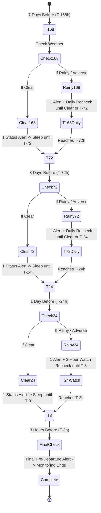
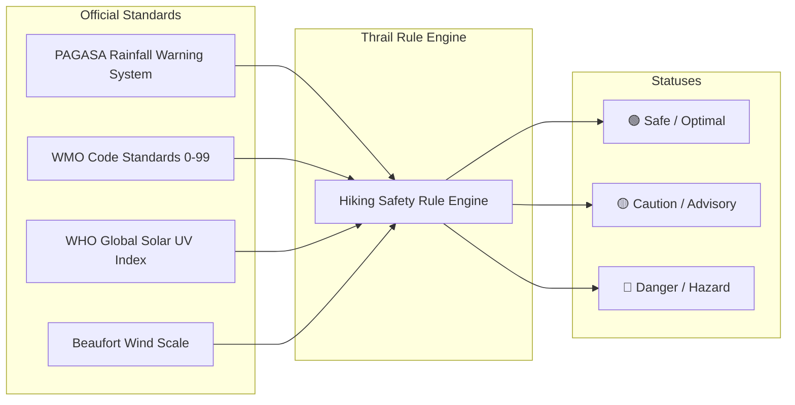

# 🌦️ Thrail — Weather Alert Feature Implementation Plan

## 1. Executive Summary & Objective

The objective of this feature is to proactively notify and alert Thrail users about critical weather conditions (such as upcoming rain, heavy storms, high winds, or extreme heat) that impact their hiking safety and gear preparation.

Rather than acting as a generic weather forecaster, this feature is built specifically for mountaineering safety by:
1. **Group-Centric Tracking**: Monitoring weather per active hike group (`/groups/{groupId}`) and saving alerts directly to `/groups/{groupId}/alerts/{alertId}`.
2. **Progressive T-Minus Countdown Monitoring**: Checking weather at structured intervals (**T-168h, T-72h, T-24h, T-3h**).
3. **Actionable Hiking Gear Checklists**: Converting meteorological data into concrete preparation items for hikers and guides.

---

## 2. Progressive T-Minus Monitoring Schedule

Monitoring begins **7 days before the hike date** for all active hike groups (`/groups/{groupId}`).



### Schedule Timeline Breakdown:

| Countdown Phase | Timing Before Hike | Condition Logic | Action / Output |
| :--- | :--- | :--- | :--- |
| **Phase 1: T-168 hrs** *(7 days)* | 1 week prior | • **If Rainy/Adverse:** Send 1 alert, schedule daily re-check until clear or T-72.<br>• **If Clear:** Send 1 "Favorable conditions" alert, sleep until T-72. | Initial gear planning & awareness. |
| **Phase 2: T-72 hrs** *(3 days / 72h)* | 3 days prior | • **If Rainy/Adverse:** Send 1 advisory alert, repeat daily until clear or T-24.<br>• **If Clear:** Send 1 status alert, sleep until T-24. | Waterproof packing & logistics check. |
| **Phase 3: T-24 hrs** *(1 day / 24h)* | Eve of hike | • **If Rainy/Adverse:** Send 1 alert, enter **3-hour watch** (recheck every 3h until T-3).<br>• **If Clear:** Send 1 confirmation alert, sleep until T-3. | Final bag packing, rain poncho & footwear check. |
| **Phase 4: T-3 hrs** *(3 hours)* | Morning / Pre-Departure | • Final morning check: Send final departure advisory alert. | End of monitoring for this hike. |

---

## 3. Scientific & Meteorological Standards Reference

To ensure objective and defensible thresholds, Thrail aligns its severity classifications with standard meteorological organizations:



### A. Precipitation & Rain Threshold References
* **PAGASA (Philippine Atmospheric, Geophysical and Astronomical Services Administration)**:
  * *Light Rain / Drizzle*: `< 2.5 mm/hr`
  * *Moderate Rain (Yellow Alert)*: `2.5 mm – 7.5 mm/hr` (Ground saturation, slippery trail descent).
  * *Heavy Rain (Orange Alert)*: `7.5 mm – 15 mm/hr` (Threat of flash floods, swollen streams, trail erosion).
  * *Torrential Rain (Red Warning)*: `> 15 mm/hr` (Severe hazard; outdoor mountain ascent prohibited).
* **NWS / Outdoor Probability of Precipitation (PoP)**:
  * `PoP < 30%`: Unlikely rain -> **🟢 SAFE** (Optimal hiking).
  * `PoP 40% – 69%`: Scattered showers / drizzle -> **🟡 CAUTION** (Wet trails; rainwear required).
  * `PoP ≥ 70%`: Definite precipitation -> **🔴 DANGER** (High risk of severe rain, muddy slopes).

### B. Severe Weather Codes (World Meteorological Organization - WMO)
* `Codes 0–3`: Clear Sky, Mainly Clear, Partly Cloudy -> **🟢 SAFE**
* `Codes 51–63, 80–81`: Drizzle, Light/Moderate Rain, Fog -> **🟡 CAUTION**
* `Codes 65, 75, 82, 95, 96, 99`: Torrential Rain, Violent Showers, Thunderstorms -> **🔴 DANGER** *(Lightning hazard on exposed mountain peaks and ridges)*.

### C. Wind Speed (Beaufort Scale for Mountain Ridges)
* `< 30 km/h` (Beaufort 1–4): Gentle/Moderate breeze -> **🟢 SAFE**
* `40 – 60 km/h` (Beaufort 6–7): Strong breeze / Near gale -> **🟡 CAUTION** (Difficulty walking on open ridges).
* `> 60 km/h` (Beaufort 8+): Gale / Storm force -> **🔴 DANGER** (Hazardous on exposed summits).

### D. UV Index (WHO Global Solar UV Index)
* `UV 1–5`: Low to Moderate -> **🟢 SAFE**
* `UV 6–10`: High to Very High -> **🟡 CAUTION** (Sun protection & standard hydration).
* `UV ≥ 11`: Extreme -> **☀️ HEAT ADVISORY** (Severe heat exhaustion risk; 2.5L–3L hydration required).

---

## 4. Group-Based Data Architecture (`/groups/{groupId}/alerts`)

Every hike in Thrail is linked to a group under `/groups/{groupId}` with:
* `trail`: Target mountain information (coordinates, name).
* `offer.date`: The scheduled hike date.
* `participantsIds`: Array of user IDs (`string[]`) joining the hike.

### A. Firestore Document Path
```
/groups/{groupId}/alerts/{alertId}
```

### B. Firestore Schema (`WeatherAlert`)
```typescript
export interface IWeatherAlertDB {
    id: string;
    groupId: string;
    trailName: string;
    phase: 'T-168' | 'T-72' | 'T-24' | 'T-3';
    status: 'SAFE' | 'CAUTION' | 'DANGER';
    headline: string;
    message: string;
    metrics: {
        temperature: number;
        precipitationProbability: number;
        weatherCode: number;
        windSpeed: number;
        uvIndex: number;
    };
    checklist: Array<{
        id: string;
        label: string;
        category: string;
    }>;
    createdAt: FirebaseFirestore.FieldValue | FirebaseFirestore.Timestamp;
}
```

### C. Automated Execution Process (Inside Cloud Function)
```
[Scheduled Cloud Function / Cloud Tasks]
     │
     ▼
1. Query active groups (/groups where status == 'active')
     │
     ▼
2. Check countdown phase (T-168, T-72, T-24, T-3) relative to group.offer.date
     │
     ▼
3. Fetch Open-Meteo forecast for group.trail.coordinates
     │
     ▼
4. Evaluate Safety & Rain Rules (Safe / Caution / Danger)
     │
     ▼
5. Save alert document to /groups/{groupId}/alerts/{alertId}
     │
     ▼
6. Query device tokens for users in group.participantsIds
     │
     ▼
7. Dispatch Multicast Push Notification to participants only
     │
     ▼
8. Write in-app notification to users/{userId}/notifications for all participants
```

---

## 5. UI Integration Surfaces

1. **Group Chat Screen (`/groups/{groupId}`)**:
   * Pinned Weather Safety Bulletin at the top of the group chat.
   * Both hikers and guides can view the current weather alert and gear checklist together.
2. **Notifications Screen (`NotificationScreen`)**:
   * Clicking a weather notification navigates directly to the group or trail weather page.
3. **Trail Detail Screen & Weather Screen**:
   * Interactive checkable gear checklist with real-time Open-Meteo weather data.

---

## 6. Implementation Checklist

- [ ] **Data Model**: Add `IWeatherAlert` interface and types in `src/core/models/Group/interfaces/Group.types.ts`.
- [ ] **Cloud Function Scheduler**: Update `functions/index.js` to iterate active `/groups` and manage the T-168, T-72, T-24, and T-3 progressive monitoring schedule.
- [ ] **Firestore Writer**: Save generated alerts to `/groups/{groupId}/alerts/{alertId}` with full metrics and checklist.
- [ ] **Participant Multicast**: Fetch tokens from `users/{userId}.fcmTokens` matching `group.participantsIds`.
- [ ] **Group Chat UI Widget**: Add a weather alert card/banner inside the group chat screen.
